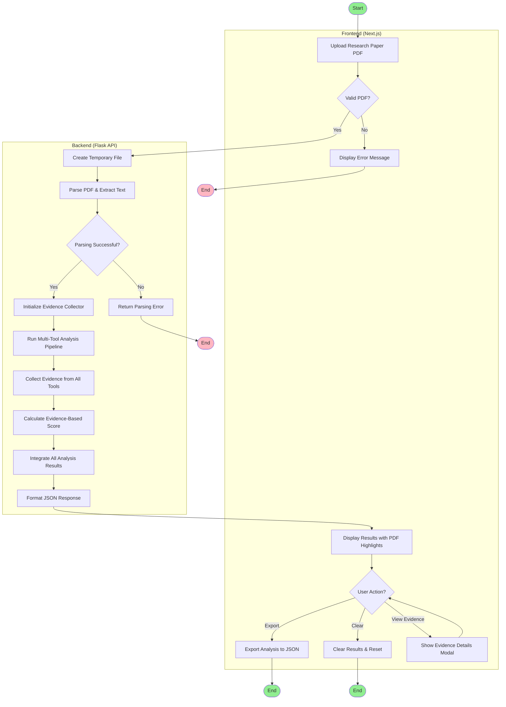

## End-to-End Process (High-Level)

```mermaid
graph TD
    Start([Start]) --> Upload[Upload Research Paper PDF]
    Upload --> Validate{Valid PDF?}
    Validate -->|No| Error1[Display Error Message]
    Error1 --> End1([End])
    Validate -->|Yes| CreateTemp[Create Temporary File]
    CreateTemp --> ParsePDF[Parse PDF & Extract Text]
    ParsePDF --> ParseSuccess{Parsing Successful?}
    ParseSuccess -->|No| Error2[Return Parsing Error]
    Error2 --> End2([End])
    ParseSuccess -->|Yes| InitEvidence[Initialize Evidence Collector]
    InitEvidence --> RunAnalysis[Run Multi-Tool Analysis Pipeline]
    RunAnalysis --> CollectEvidence[Collect Evidence from All Tools]
    CollectEvidence --> CalculateScore[Calculate Evidence-Based Score]
    CalculateScore --> IntegrateResults[Integrate All Analysis Results]
    IntegrateResults --> FormatResponse[Format JSON Response]
    FormatResponse --> DisplayResults[Display Results with PDF Highlights]
    DisplayResults --> UserAction{User Action?}
    UserAction -->|Export| Export[Export Analysis to JSON]
    Export --> End3([End])
    UserAction -->|Clear| Clear[Clear Results & Reset]
    Clear --> End4([End])
    UserAction -->|View Evidence| ViewEvidence[Show Evidence Details Modal]
    ViewEvidence --> UserAction
    
    subgraph "Frontend (Next.js)"
        Upload
        Validate
        Error1
        DisplayResults
        UserAction
        Export
        Clear
        ViewEvidence
    end
    
    subgraph "Backend (Flask API)"
        CreateTemp
        ParsePDF
        ParseSuccess
        Error2
        InitEvidence
        RunAnalysis
        CollectEvidence
        CalculateScore
        IntegrateResults
        FormatResponse
    end
    
    style Start fill:#90EE90
    style End1 fill:#FFB6C1
    style End2 fill:#FFB6C1
    style End3 fill:#90EE90
    style End4 fill:#90EE90
```