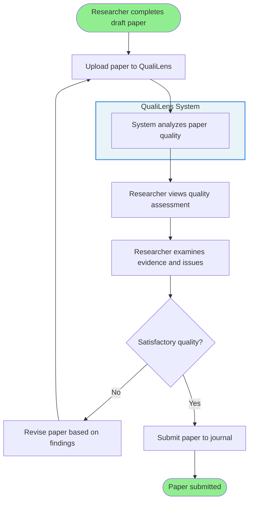
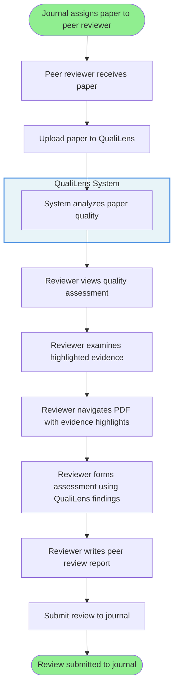

## Scenario A: Researcher Self-Assessment Workflow

```mermaid
graph TD
    Start([Researcher completes draft paper])
    Upload[Upload paper to QualiLens]
    
    subgraph QualiLens["QualiLens System"]
        Analyze[System analyzes paper quality]
    end
    
    ViewResults[Researcher views quality assessment]
    ReviewEvidence[Researcher examines evidence and issues]
    Decision{Satisfactory quality?}
    Revise[Revise paper based on findings]
    Submit[Submit paper to journal]
    End([Paper submitted])
    
    Start --> Upload
    Upload --> Analyze
    Analyze --> ViewResults
    ViewResults --> ReviewEvidence
    ReviewEvidence --> Decision
    Decision -->|No| Revise
    Revise --> Upload
    Decision -->|Yes| Submit
    Submit --> End
    
    style QualiLens fill:#E8F4F8,stroke:#4A90E2,stroke-width:2px
    style Start fill:#90EE90
    style End fill:#90EE90
```

## Scenario B: Peer Review Assessment Workflow

```mermaid
graph TD
    Start([Journal assigns paper to peer reviewer])
    Receive[Peer reviewer receives paper]
    Upload[Upload paper to QualiLens]
    
    subgraph QualiLens["QualiLens System"]
        Analyze[System analyzes paper quality]
    end
    
    ViewResults[Reviewer views quality assessment]
    ExamineEvidence[Reviewer examines highlighted evidence]
    ReviewPDF[Reviewer navigates PDF with evidence highlights]
    FormOpinion[Reviewer forms assessment using QualiLens findings]
    WriteReview[Reviewer writes peer review report]
    Submit[Submit review to journal]
    End([Review submitted to journal])
    
    Start --> Receive
    Receive --> Upload
    Upload --> Analyze
    Analyze --> ViewResults
    ViewResults --> ExamineEvidence
    ExamineEvidence --> ReviewPDF
    ReviewPDF --> FormOpinion
    FormOpinion --> WriteReview
    WriteReview --> Submit
    Submit --> End
    
    style QualiLens fill:#E8F4F8,stroke:#4A90E2,stroke-width:2px
    style Start fill:#90EE90
    style End fill:#90EE90
```