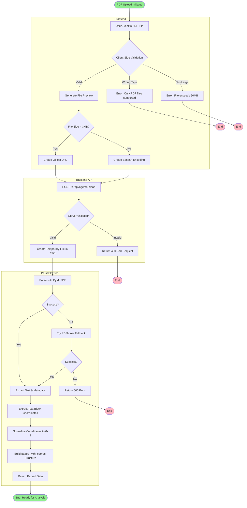
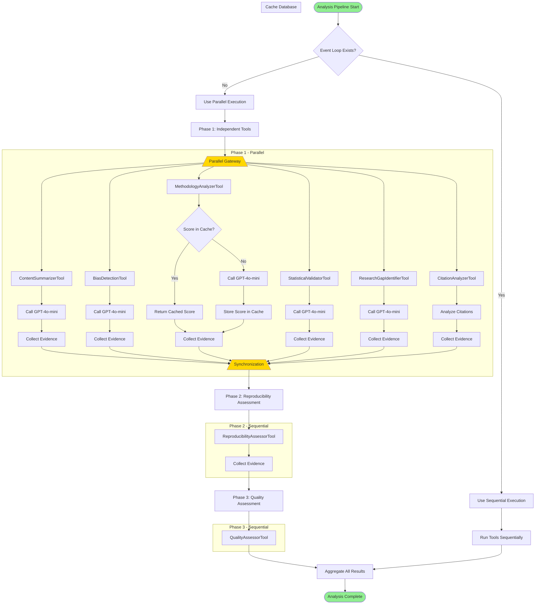
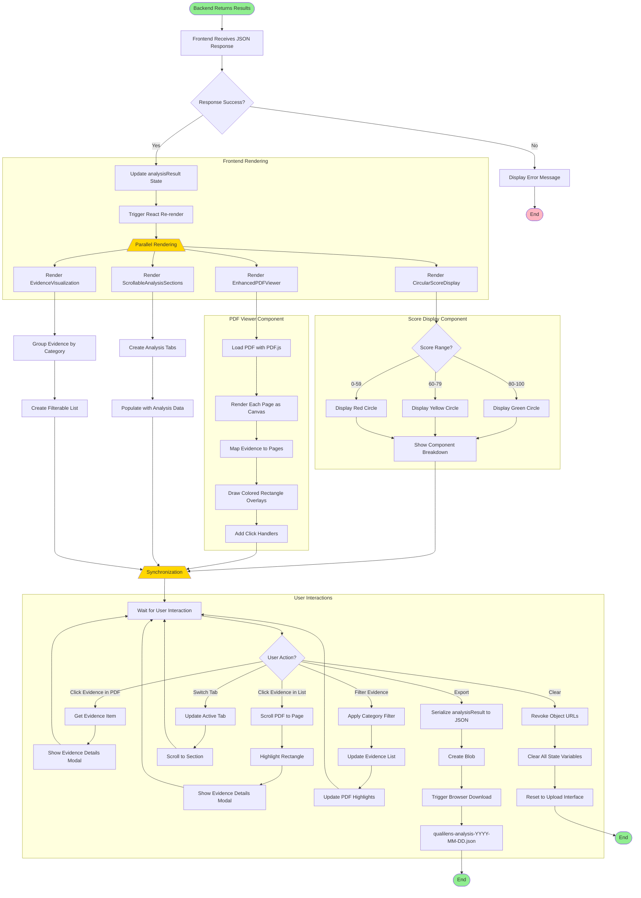

### Activity diagrams

## 1. PDF Upload and Parsing Sub-Process

```mermaid
graph TD
    Start([PDF Upload Initiated]) --> SelectFile[User Selects PDF File]
    SelectFile --> ValidateClient{Client-Side Validation}
    ValidateClient -->|Wrong Type| ErrorType[Error: Only PDF files supported]
    ErrorType --> End1([End])
    ValidateClient -->|Too Large| ErrorSize[Error: File exceeds 50MB]
    ErrorSize --> End2([End])
    ValidateClient -->|Valid| Preview[Generate File Preview]
    Preview --> CheckSize{File Size > 3MB?}
    CheckSize -->|Yes| ObjectURL[Create Object URL]
    CheckSize -->|No| Base64[Create Base64 Encoding]
    ObjectURL --> Upload[POST to /api/agent/upload]
    Base64 --> Upload
    Upload --> ServerValidate{Server Validation}
    ServerValidate -->|Invalid| Error400[Return 400 Bad Request]
    Error400 --> End3([End])
    ServerValidate -->|Valid| TempFile[Create Temporary File in /tmp]
    TempFile --> PyMuPDF[Parse with PyMuPDF]
    PyMuPDF --> PyMuPDFSuccess{Success?}
    PyMuPDFSuccess -->|No| Fallback[Try PDFMiner Fallback]
    Fallback --> FallbackSuccess{Success?}
    FallbackSuccess -->|No| Error500[Return 500 Error]
    Error500 --> End4([End])
    PyMuPDFSuccess -->|Yes| ExtractText[Extract Text & Metadata]
    FallbackSuccess -->|Yes| ExtractText
    ExtractText --> ExtractCoords[Extract Text Block Coordinates]
    ExtractCoords --> NormalizeCoords[Normalize Coordinates to 0-1]
    NormalizeCoords --> BuildStructure[Build pages_with_coords Structure]
    BuildStructure --> ReturnData[Return Parsed Data]
    ReturnData --> End5([End: Ready for Analysis])
    
    subgraph "Frontend"
        SelectFile
        ValidateClient
        ErrorType
        ErrorSize
        Preview
        CheckSize
        ObjectURL
        Base64
    end
    
    subgraph "Backend API"
        Upload
        ServerValidate
        Error400
        TempFile
    end
    
    subgraph "ParsePDFTool"
        PyMuPDF
        PyMuPDFSuccess
        Fallback
        FallbackSuccess
        Error500
        ExtractText
        ExtractCoords
        NormalizeCoords
        BuildStructure
        ReturnData
    end
    
    style Start fill:#90EE90
    style End5 fill:#90EE90
    style End1 fill:#FFB6C1
    style End2 fill:#FFB6C1
    style End3 fill:#FFB6C1
    style End4 fill:#FFB6C1
```

## 2. Multi-Tool Analysis Pipeline

```mermaid
graph TD
    Start([Analysis Pipeline Start]) --> CheckStrategy{Event Loop Exists?}
    CheckStrategy -->|Yes| Sequential[Use Sequential Execution]
    CheckStrategy -->|No| Parallel[Use Parallel Execution]
    
    Parallel --> Phase1Start[Phase 1: Independent Tools]
    Phase1Start --> ParallelGate1[/Parallel Gateway\]
    
    ParallelGate1 --> Tool1[ContentSummarizerTool]
    ParallelGate1 --> Tool2[BiasDetectionTool]
    ParallelGate1 --> Tool3[MethodologyAnalyzerTool]
    ParallelGate1 --> Tool4[StatisticalValidatorTool]
    ParallelGate1 --> Tool5[ResearchGapIdentifierTool]
    ParallelGate1 --> Tool6[CitationAnalyzerTool]
    
    Tool1 --> LLM1[Call GPT-4o-mini]
    Tool2 --> LLM2[Call GPT-4o-mini]
    Tool3 --> Cache{Score in Cache?}
    Cache -->|Yes| CacheHit[Return Cached Score]
    Cache -->|No| LLM3[Call GPT-4o-mini]
    LLM3 --> StoreCache[Store Score in Cache]
    Tool4 --> LLM4[Call GPT-4o-mini]
    Tool5 --> LLM5[Call GPT-4o-mini]
    Tool6 --> Analyze6[Analyze Citations]
    
    LLM1 --> Evidence1[Collect Evidence]
    LLM2 --> Evidence2[Collect Evidence]
    CacheHit --> Evidence3[Collect Evidence]
    StoreCache --> Evidence3
    LLM4 --> Evidence4[Collect Evidence]
    LLM5 --> Evidence5[Collect Evidence]
    Analyze6 --> Evidence6[Collect Evidence]
    
    Evidence1 --> Sync1[/Synchronization\]
    Evidence2 --> Sync1
    Evidence3 --> Sync1
    Evidence4 --> Sync1
    Evidence5 --> Sync1
    Evidence6 --> Sync1
    
    Sync1 --> Phase2[Phase 2: Reproducibility Assessment]
    Phase2 --> Tool7[ReproducibilityAssessorTool]
    Tool7 --> Evidence7[Collect Evidence]
    Evidence7 --> Phase3[Phase 3: Quality Assessment]
    Phase3 --> Tool8[QualityAssessorTool]
    Tool8 --> Aggregate[Aggregate All Results]
    
    Sequential --> SeqTool1[Run Tools Sequentially]
    SeqTool1 --> Aggregate
    
    Aggregate --> End([Analysis Complete])
    
    subgraph "Phase 1 - Parallel"
        ParallelGate1
        Tool1
        Tool2
        Tool3
        Tool4
        Tool5
        Tool6
        LLM1
        LLM2
        Cache
        CacheHit
        LLM3
        StoreCache
        LLM4
        LLM5
        Analyze6
        Evidence1
        Evidence2
        Evidence3
        Evidence4
        Evidence5
        Evidence6
        Sync1
    end
    
    subgraph "Phase 2 - Sequential"
        Tool7
        Evidence7
    end
    
    subgraph "Phase 3 - Sequential"
        Tool8
    end
    
    subgraph "Cache Database"
        Cache
        CacheHit
        StoreCache
    end
    
    style Start fill:#90EE90
    style End fill:#90EE90
    style ParallelGate1 fill:#FFD700
    style Sync1 fill:#FFD700
```

## 3. Results Visualization and User Interaction

```mermaid
graph TD
    Start([Backend Returns Results]) --> ReceiveJSON[Frontend Receives JSON Response]
    ReceiveJSON --> ValidateResponse{Response Success?}
    ValidateResponse -->|No| ShowError[Display Error Message]
    ShowError --> End1([End])
    ValidateResponse -->|Yes| UpdateState[Update analysisResult State]
    UpdateState --> TriggerRender[Trigger React Re-render]
    TriggerRender --> ParallelRender[/Parallel Rendering\]
    
    ParallelRender --> RenderScore[Render CircularScoreDisplay]
    ParallelRender --> RenderPDF[Render EnhancedPDFViewer]
    ParallelRender --> RenderSections[Render ScrollableAnalysisSections]
    ParallelRender --> RenderEvidence[Render EvidenceVisualization]
    
    RenderScore --> CalcColor{Score Range?}
    CalcColor -->|80-100| GreenCircle[Display Green Circle]
    CalcColor -->|60-79| YellowCircle[Display Yellow Circle]
    CalcColor -->|0-59| RedCircle[Display Red Circle]
    GreenCircle --> ShowBreakdown[Show Component Breakdown]
    YellowCircle --> ShowBreakdown
    RedCircle --> ShowBreakdown
    
    RenderPDF --> LoadPDFJS[Load PDF with PDF.js]
    LoadPDFJS --> RenderPages[Render Each Page as Canvas]
    RenderPages --> MapEvidence[Map Evidence to Pages]
    MapEvidence --> DrawHighlights[Draw Colored Rectangle Overlays]
    DrawHighlights --> AddHandlers[Add Click Handlers]
    
    RenderSections --> CreateTabs[Create Analysis Tabs]
    CreateTabs --> PopulateData[Populate with Analysis Data]
    
    RenderEvidence --> GroupEvidence[Group Evidence by Category]
    GroupEvidence --> CreateList[Create Filterable List]
    
    ShowBreakdown --> SyncPoint[/Synchronization\]
    AddHandlers --> SyncPoint
    PopulateData --> SyncPoint
    CreateList --> SyncPoint
    
    SyncPoint --> WaitUser[Wait for User Interaction]
    WaitUser --> UserAction{User Action?}
    
    UserAction -->|Click Evidence in PDF| GetEvidence1[Get Evidence Item]
    GetEvidence1 --> ShowModal1[Show Evidence Details Modal]
    ShowModal1 --> WaitUser
    
    UserAction -->|Click Evidence in List| ScrollPDF[Scroll PDF to Page]
    ScrollPDF --> HighlightRect[Highlight Rectangle]
    HighlightRect --> ShowModal2[Show Evidence Details Modal]
    ShowModal2 --> WaitUser
    
    UserAction -->|Switch Tab| ChangeTab[Update Active Tab]
    ChangeTab --> ScrollSection[Scroll to Section]
    ScrollSection --> WaitUser
    
    UserAction -->|Filter Evidence| ApplyFilter[Apply Category Filter]
    ApplyFilter --> UpdateList[Update Evidence List]
    UpdateList --> UpdateHighlights[Update PDF Highlights]
    UpdateHighlights --> WaitUser
    
    UserAction -->|Export| SerializeJSON[Serialize analysisResult to JSON]
    SerializeJSON --> CreateBlob[Create Blob]
    CreateBlob --> TriggerDownload[Trigger Browser Download]
    TriggerDownload --> FileName["qualilens-analysis-YYYY-MM-DD.json"]
    FileName --> End2([End])
    
    UserAction -->|Clear| RevokeURL[Revoke Object URLs]
    RevokeURL --> ClearState[Clear All State Variables]
    ClearState --> ResetUI[Reset to Upload Interface]
    ResetUI --> End3([End])
    
    subgraph "Frontend Rendering"
        UpdateState
        TriggerRender
        ParallelRender
        RenderScore
        RenderPDF
        RenderSections
        RenderEvidence
    end
    
    subgraph "Score Display Component"
        CalcColor
        GreenCircle
        YellowCircle
        RedCircle
        ShowBreakdown
    end
    
    subgraph "PDF Viewer Component"
        LoadPDFJS
        RenderPages
        MapEvidence
        DrawHighlights
        AddHandlers
    end
    
    subgraph "User Interactions"
        WaitUser
        UserAction
        GetEvidence1
        ShowModal1
        ScrollPDF
        HighlightRect
        ShowModal2
        ChangeTab
        ScrollSection
        ApplyFilter
        UpdateList
        UpdateHighlights
        SerializeJSON
        CreateBlob
        TriggerDownload
        FileName
        RevokeURL
        ClearState
        ResetUI
    end
    
    style Start fill:#90EE90
    style End1 fill:#FFB6C1
    style End2 fill:#90EE90
    style End3 fill:#90EE90
    style ParallelRender fill:#FFD700
    style SyncPoint fill:#FFD700
```

## 4. Error Handling Process Model

```mermaid
graph TD
    Start([Process Execution]) --> Monitor{Error Occurred?}
    Monitor -->|No| Continue[Continue Normal Flow]
    Continue --> Monitor
    
    Monitor -->|Yes| ErrorType{Error Type?}
    
    ErrorType -->|File Upload Error| FileError{Specific Issue?}
    FileError -->|No File| Return400_1[Return 400: No file provided]
    FileError -->|Empty Name| Return400_2[Return 400: No file selected]
    FileError -->|Wrong Type| Return400_3[Return 400: Only PDF files supported]
    FileError -->|Too Large| Return400_4[Return 400: File too large]
    FileError -->|Empty File| Return400_5[Return 400: Empty file provided]
    
    ErrorType -->|PDF Parsing Error| ParseError{Parsing Stage?}
    ParseError -->|PyMuPDF Failed| TryFallback[Try PDFMiner Fallback]
    TryFallback --> FallbackOK{Fallback Success?}
    FallbackOK -->|Yes| ContinueParsing[Continue with Parsed Data]
    FallbackOK -->|No| Return500_1[Return 500: PDF parsing failed]
    ParseError -->|Password Protected| Return500_2[Return 500: Password-protected PDF]
    ParseError -->|Corrupted| Return500_3[Return 500: Corrupted PDF]
    
    ErrorType -->|LLM API Error| APIError{API Issue?}
    APIError -->|Missing Key| Return500_4[Return 500: API key not configured]
    APIError -->|Rate Limit| Return429[Return 429: Rate limit exceeded]
    APIError -->|Timeout| Return504[Return 504: Analysis timed out]
    APIError -->|Invalid Response| UsePartial[Return Partial Results with Warning]
    
    ErrorType -->|Agent Error| AgentError{Agent Issue?}
    AgentError -->|No Agent Found| Return400_6[Return 400: No suitable agent]
    AgentError -->|Execution Failed| Return500_5[Return 500: Agent execution failed]
    
    ErrorType -->|Tool Error| ToolError[Tool Execution Failed]
    ToolError --> ContinueOther[Continue with Other Tools]
    ContinueOther --> MarkPartial[Mark Analysis as Partial]
    MarkPartial --> ReturnPartial[Return Partial Results]
    
    ErrorType -->|Evidence Error| EvidenceError{Evidence Issue?}
    EvidenceError -->|Page Detection Failed| DefaultPage1[Default to Page 1]
    EvidenceError -->|Bounding Box Failed| EstimateBox[Use Estimated Bounding Box]
    EvidenceError -->|No Evidence| GenerateFallback[Generate Fallback Evidence]
    DefaultPage1 --> LogWarning1[Log Warning]
    EstimateBox --> LogWarning2[Log Warning]
    GenerateFallback --> LogWarning3[Log Warning]
    
    ErrorType -->|Frontend Error| FrontendError{Frontend Issue?}
    FrontendError -->|Connection Failed| ShowConnError[Show: Cannot connect to backend]
    FrontendError -->|PDF Render Failed| ShowPDFError[Show: Failed to load PDF]
    FrontendError -->|Out of Memory| ShowMemError[Show: Memory error - try smaller file]
    
    Return400_1 --> CleanupTemp1[Cleanup Temporary Files]
    Return400_2 --> CleanupTemp1
    Return400_3 --> CleanupTemp1
    Return400_4 --> CleanupTemp1
    Return400_5 --> CleanupTemp1
    Return400_6 --> CleanupTemp1
    Return429 --> CleanupTemp1
    Return500_1 --> CleanupTemp1
    Return500_2 --> CleanupTemp1
    Return500_3 --> CleanupTemp1
    Return500_4 --> CleanupTemp1
    Return500_5 --> CleanupTemp1
    Return504 --> CleanupTemp1
    
    CleanupTemp1 --> LogError[Log Error Details]
    LogWarning1 --> ContinueProcess1[Continue Process]
    LogWarning2 --> ContinueProcess1
    LogWarning3 --> ContinueProcess1
    UsePartial --> LogError
    ReturnPartial --> LogError
    ContinueParsing --> Monitor
    ContinueProcess1 --> Monitor
    
    ShowConnError --> UserRetry1{User Retries?}
    ShowPDFError --> UserRetry1
    ShowMemError --> UserRetry1
    UserRetry1 -->|Yes| Start
    UserRetry1 -->|No| End2([End])
    
    LogError --> End1([End with Error])
    
    subgraph "Error Categories"
        FileError
        ParseError
        APIError
        AgentError
        ToolError
        EvidenceError
        FrontendError
    end
    
    subgraph "Recovery Actions"
        TryFallback
        ContinueOther
        DefaultPage1
        EstimateBox
        GenerateFallback
        UsePartial
    end
    
    subgraph "Cleanup"
        CleanupTemp1
        LogError
        LogWarning1
        LogWarning2
        LogWarning3
    end
    
    style Start fill:#90EE90
    style End1 fill:#FFB6C1
    style End2 fill:#FFB6C1
    style Continue fill:#90EE90
```