### Activity diagrams

## Activity Diagram 1: PDF Upload and Parsing

## Activity Diagram 2: Multi-Tool Analysis Pipeline

```mermaid
graph TD
    Start([Start: Text extracted])
    
    subgraph DataObjects["Input Data"]
        D0["text_content: string<br/>pages_with_coords: list"]
    end
    
    subgraph Backend["Paper Analysis Agent"]
        B1[Initialize Evidence Collector]
        B2{Event loop exists?}
        B3[Try async parallel execution]
        B4{Already in async<br/>context?}
        B5[Execute sequential<br/>fallback strategy]
        B6[Execute async parallel<br/>strategy]
        ForkBar["═══════════════════════════════<br/>FORK (Parallel Execution)"]
        JoinBar["═══════════════════════════════<br/>JOIN (Synchronization)"]
    end
    
    subgraph Phase1["Phase 1: Independent Analysis Tools"]
        T1[ContentSummarizerTool]
        T2[BiasDetectionTool]
        T3[MethodologyAnalyzerTool]
        T4[StatisticalValidatorTool]
        T5[ResearchGapIdentifierTool]
        T6[CitationAnalyzerTool]
    end
    
    subgraph OpenAI["OpenAI API"]
        API1[GPT-4o-mini<br/>Summarize]
        API2[GPT-4o-mini<br/>Detect biases]
        API3[GPT-4o-mini<br/>Analyze methodology]
        API4[GPT-4o-mini<br/>Validate statistics]
        API5[GPT-4o-mini<br/>Identify gaps]
    end
    
    subgraph Cache["💾 SQLite Cache"]
        C1{Score cached?}
        C2[Retrieve cached score]
        C3[Store score in cache]
    end
    
    subgraph Evidence["Evidence Collector"]
        E1[Collect evidence from tools]
    end
    
    subgraph Phase2["Phase 2: Reproducibility Assessment (Sequential)"]
        T7[ReproducibilityAssessorTool]
        API7[Analyze reproducibility]
    end
    
    subgraph Phase3["Phase 3: Quality Assessment (Sequential)"]
        T8[QualityAssessorTool]
        AGG[Aggregate all tool results]
    end
    
    subgraph Results["Analysis Results"]
        R1[Analysis Results]
    end
    
    Start --> D0
    D0 --> B1
    B1 --> B2
    B2 -->|No| B3
    B2 -->|Yes| B4
    
    B3 --> B4
    B4 -->|Yes| B5
    B4 -->|No| B6
    
    B5 --> T1
    B6 --> ForkBar
    
    ForkBar --> T1
    ForkBar --> T2
    ForkBar --> T3
    ForkBar --> T4
    ForkBar --> T5
    ForkBar --> T6
    
    T1 --> API1
    API1 --> E1
    E1 --> R1
    
    T2 --> API2
    API2 --> E1
    E1 --> R1
    
    T3 --> C1
    C1 -->|Yes| C2
    C1 -->|No| API3
    API3 --> C3
    C2 --> E1
    C3 --> E1
    E1 --> R1
    
    T4 --> API4
    API4 --> E1
    E1 --> R1
    
    T5 --> API5
    API5 --> E1
    E1 --> R1
    
    T6 --> E1
    E1 --> R1
    
    R1 --> JoinBar
    
    JoinBar --> T7
    T7 --> API7
    API7 --> E1
    E1 --> R1
    
    R1 --> T8
    T8 --> AGG
    AGG --> R1
    
    R1 --> End([End: Analysis Complete])
    
    style Start fill:#90EE90
    style End fill:#90EE90
    style ForkBar fill:#FFD700
    style JoinBar fill:#FFD700
    style D0 fill:#E6F3FF
    style R1 fill:#E6F3FF
```

## Activity Diagram 3: Initial Results Rendering

```mermaid
graph TD
    Start([Start: Backend returns results])
    
    subgraph Backend["Backend API"]
        B1[Serialize to JSON]
        B2[Send HTTP 200 response]
    end
    
    subgraph DataTransfer["Network Transfer"]
        N1["analysisResult: JSON<br/>(50-500 KB)"]
    end
    
    subgraph Frontend["Frontend (React)"]
        F1[Receive JSON response]
        F2{Response.success?}
        F3[Process response:<br/>Parse JSON & update state]
        F4[Trigger React re-render]
        ForkBar["═══════════════════════════════<br/>FORK (Parallel Rendering)"]
        E1[Display error message]
    end
    
    subgraph ScoreComponent["CircularScoreDisplay Component"]
        S1[Get overall_quality_score]
        S2{Score range?}
        S3[Render green circle<br/>80-100]
        S4[Render yellow circle<br/>60-79]
        S5[Render red circle<br/>0-59]
        S6[Render component breakdown:<br/>Methodology 60%<br/>Bias 20%<br/>Reproducibility 10%<br/>Statistics 10%]
    end
    
    subgraph PDFViewer["EnhancedPDFViewer Component"]
        P1[Load PDF with PDF.js]
        P2{PDF type?}
        P3[Load from Object URL]
        P4[Convert Base64 to Blob]
        P5[Render pages as canvas]
        P6[Get evidence_traces]
        P7[Map evidence to pages]
        P8[Calculate absolute coordinates]
        P9[Draw colored overlays:<br/>Bias<br/>Methodology<br/>Reproducibility<br/>Statistics]
        P10[Add click handlers]
    end
    
    subgraph Sections["ScrollableAnalysisSections Component"]
        SEC1[Create 8 analysis tabs]
        SEC2[Populate tab content:<br/>Summary, Methodology,<br/>Bias, Statistics,<br/>Reproducibility, Gaps,<br/>Citations, Quality]
    end
    
    subgraph EvidenceVis["EvidenceVisualization Component"]
        EV1[Get evidence_traces array]
        EV2[Group by category]
        EV3[Create filterable list]
        EV4[Add navigation handlers]
    end
    
    subgraph Display["UI Display"]
        JoinBar["═══════════════════════════════<br/>JOIN (Render Complete)"]
        UI1[Display complete interface]
    end
    
    Start --> B1
    B1 --> B2
    B2 --> N1
    N1 --> F1
    F1 --> F2
    F2 -->|No| E1
    E1 --> End2([End: Display Error])
    F2 -->|Yes| F3
    F3 --> F4
    
    F4 --> ForkBar
    
    ForkBar --> S1
    ForkBar --> P1
    ForkBar --> SEC1
    ForkBar --> EV1
    
    S1 --> S2
    S2 -->|80-100| S3
    S2 -->|60-79| S4
    S2 -->|0-59| S5
    S3 --> S6
    S4 --> S6
    S5 --> S6
    S6 --> JoinBar
    
    P1 --> P2
    P2 -->|Object URL| P3
    P2 -->|Base64| P4
    P3 --> P5
    P4 --> P5
    P5 --> P6
    P6 --> P7
    P7 --> P8
    P8 --> P9
    P9 --> P10
    P10 --> JoinBar
    
    SEC1 --> SEC2
    SEC2 --> JoinBar
    
    EV1 --> EV2
    EV2 --> EV3
    EV3 --> EV4
    EV4 --> JoinBar
    
    JoinBar --> UI1
    UI1 --> End1([End: Ready for User Interaction])
    
    style Start fill:#90EE90
    style End1 fill:#90EE90
    style End2 fill:#FFB6C1
    style ForkBar fill:#FFD700
    style JoinBar fill:#FFD700
    style N1 fill:#E6F3FF
```

## Activity Diagram 4: User Interaction Flows

## Activity Diagram 5: Evidence Collection and Scoring

```mermaid
graph TD
    Start([Start: Analysis tool identifies finding])
    
    subgraph Tool["Analysis Tool"]
        T1[Extract text snippet<br/>from paper<br/>max 500 chars]
        T2[Create evidence metadata:<br/>- category<br/>- rationale<br/>- confidence<br/>- severity]
        T3[Call evidence_collector.<br/>add_evidence]
    end
    
    subgraph EvidenceCollector["Evidence Collector"]
        EC1{Page number<br/>provided?}
        EC2[Use provided<br/>page number]
        EC3[Detect page number]
    end
    
    subgraph PageDetection["Page Number Detection"]
        PD1[Normalize text snippet]
        PD2[Extract meaningful words<br/>length > 2]
        PD3[For each page in pdf_pages]
        PD4[Calculate word overlap]
        PD5{Overlap ≥ 50%?}
        PD6[Use detected page]
        PD7[Default to page 1]
    end
    
    subgraph BBoxCalculation["Bounding Box Calculation"]
        BB1{Bounding box<br/>provided?}
        BB2[Use provided<br/>bounding box]
        BB3[Calculate bounding box]
        BB4[Strategy 1:<br/>Exact substring match?]
        BB5[Use exact block coordinates]
        BB6[Strategy 2:<br/>Fuzzy match ≥ 80%?]
        BB7[Use fuzzy match coordinates]
        BB8[Strategy 3:<br/>Phrase match found?]
        BB9[Use phrase match coordinates]
        BB10[Estimate bounding box:<br/>x: 0.1, y: 0.2 + offset<br/>width: 0.8<br/>height: estimated]
    end
    
    subgraph Storage["Evidence Storage"]
        ST1[Create and store EvidenceItem<br/>with unique ID]
        ST2{More findings<br/>from tools?}
    end
    
    subgraph Scoring["Evidence-Based Scoring"]
        SC1[Get all evidence items]
        SC2[Group by category:<br/>bias, methodology,<br/>reproducibility, statistics]
        
        M1["Calculate Methodology Score<br/>Start: base_methodology_score<br/>or BASE_SCORE = 50<br/>Add/subtract score_impact<br/>from evidence items<br/>Range: 0-100"]
        
        B1["Calculate Bias Score<br/>Start: 100<br/>Add score_impact from<br/>bias evidence items<br/>impact typically negative<br/>Range: 0-100"]
        
        R1["Calculate Reproducibility Score<br/>Start: BASE_SCORE = 50<br/>Add score_impact from<br/>reproducibility evidence<br/>Range: 0-100"]
        
        S1["Calculate Statistics Score<br/>Start: BASE_SCORE = 50<br/>Add/subtract score_impact<br/>from statistics evidence<br/>Range: 0-100"]
        
        SC3[Apply weighted formula:<br/>Final = Methodology × 0.6<br/>+ Bias × 0.2<br/>+ Reproducibility × 0.1<br/>+ Statistics × 0.1]
        SC4[Clamp score to 0-100]
        SC5[Package result with:<br/>- final_score<br/>- component_scores<br/>- weighted_contributions<br/>- evidence_count]
    end
    
    subgraph Results["Scoring Results"]
        RS1[Scoring Results]
    end
    
    Start --> T1
    T1 --> T2
    T2 --> T3
    T3 --> EC1
    
    EC1 -->|Yes| EC2
    EC1 -->|No| EC3
    
    EC3 --> PD1
    PD1 --> PD2
    PD2 --> PD3
    PD3 --> PD4
    PD4 --> PD5
    PD5 -->|Yes| PD6
    PD5 -->|No| PD7
    
    EC2 --> BB1
    PD6 --> BB1
    PD7 --> BB1
    
    BB1 -->|Yes| BB2
    BB1 -->|No| BB3
    
    BB3 --> BB4
    BB4 -->|Yes| BB5
    BB4 -->|No| BB6
    BB6 -->|Yes| BB7
    BB6 -->|No| BB8
    BB8 -->|Yes| BB9
    BB8 -->|No| BB10
    
    BB2 --> ST1
    BB5 --> ST1
    BB7 --> ST1
    BB9 --> ST1
    BB10 --> ST1
    
    ST1 --> ST2
    ST2 -->|Yes| Start
    ST2 -->|No| SC1
    
    SC1 --> SC2
    SC2 --> M1
    
    M1 --> B1
    B1 --> R1
    R1 --> S1
    S1 --> SC3
    SC3 --> SC4
    SC4 --> SC5
    
    SC5 --> RS1
    RS1 --> End([End: Scoring Complete])
    
    style Start fill:#90EE90
    style End fill:#90EE90
    style RS1 fill:#E6F3FF
```

