## U-FR1: Upload or Link Papers

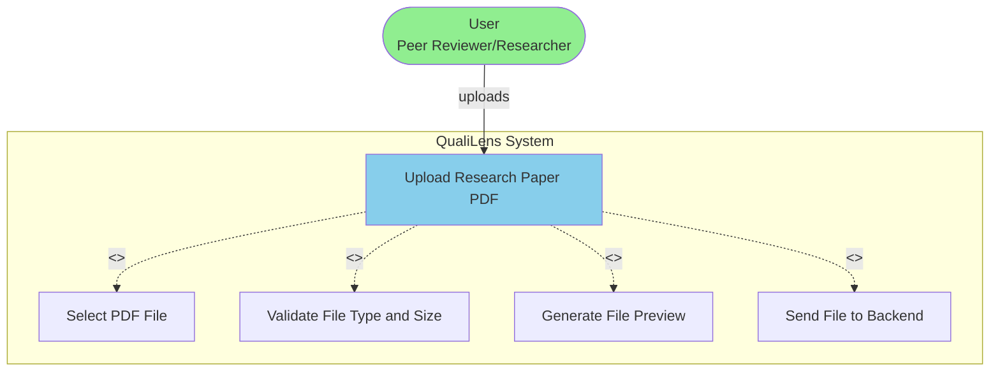

## U-FR2: Metadata Visualization

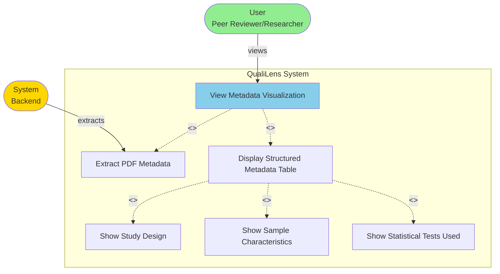

## U-FR3: Interactive Quality Scoring

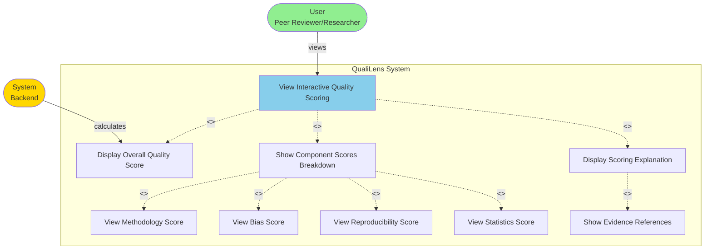

## U-FR4: Evidence Visualization

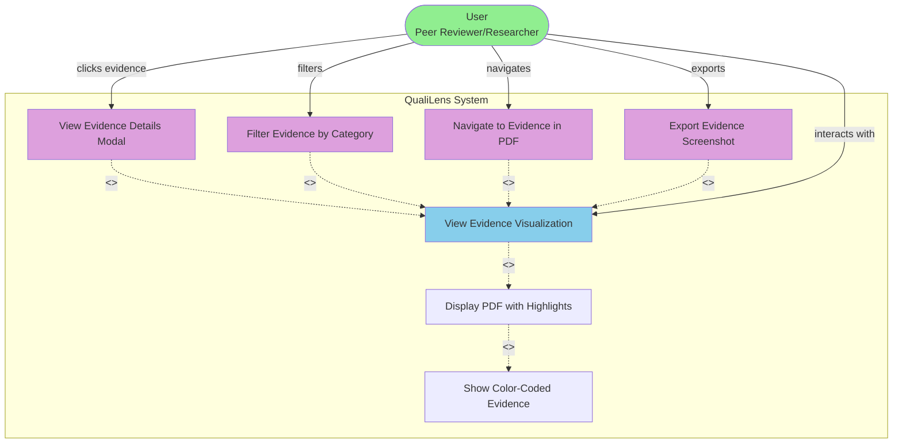

## U-FR5: Bias Reporting Dashboard

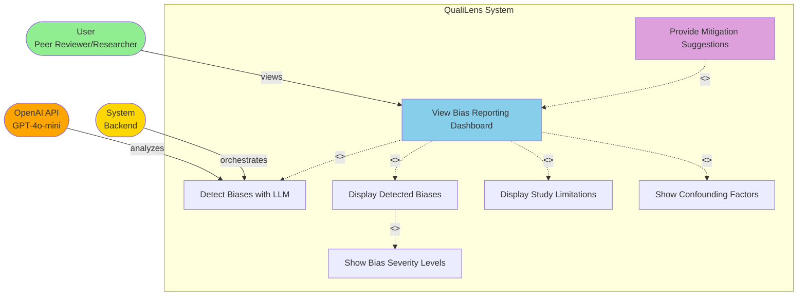

## U-FR6: Reproducibility Summary

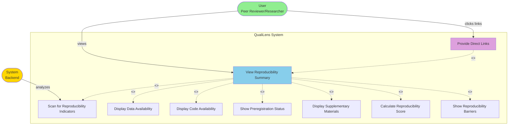

## U-FR7: Rubric Customization

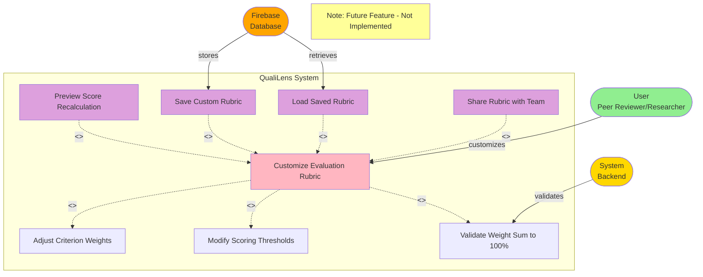

## U-FR8: Evaluation History

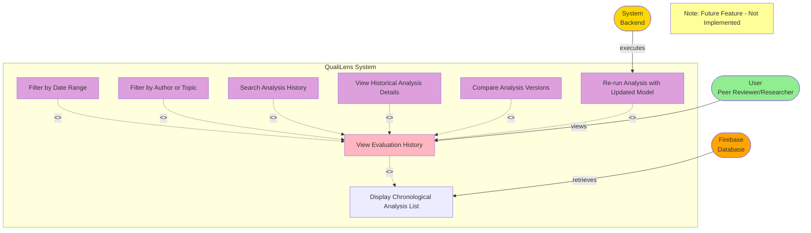

## U-FR9: Literature Benchmarking and Similarity Analysis

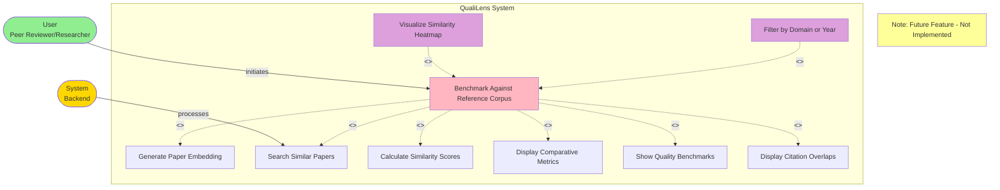

## U-FR10: Automated Abstract and Findings Summarization

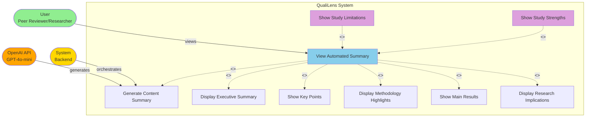

## U-FR11: Ethical and Compliance Validation

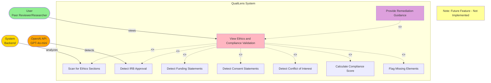

## U-FR12: Multi-Paper Comparative Dashboard

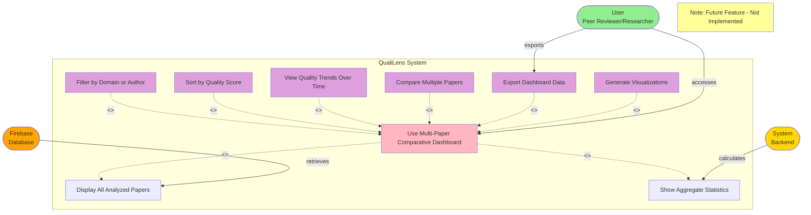
