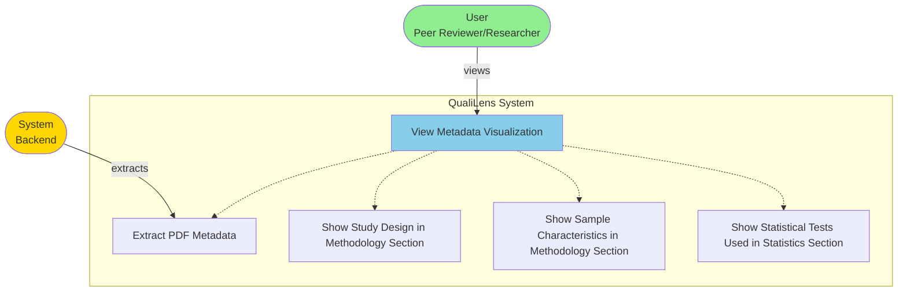
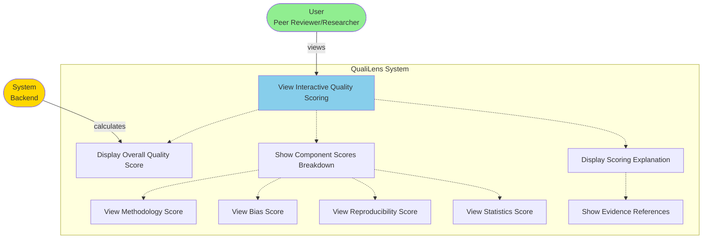
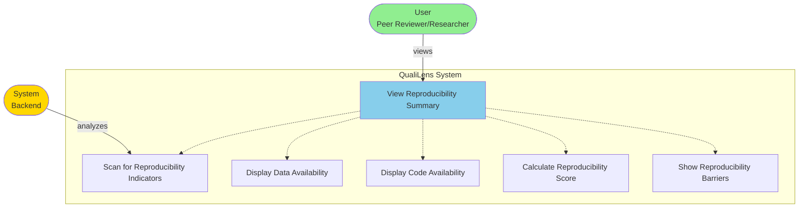
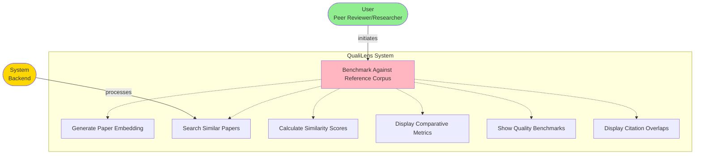
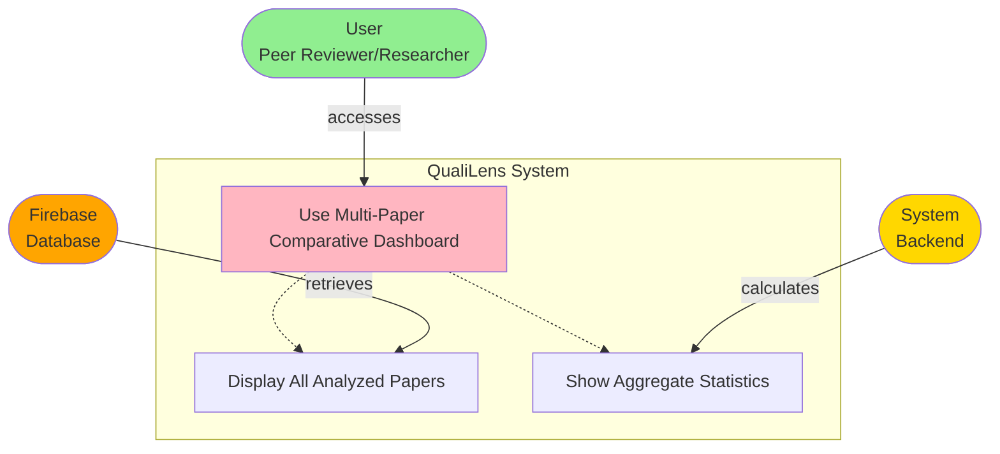

## U-FR1: Upload or Link Papers

**Note:** MIME type validation is performed server-side as part of S-FR1 (PDF Parsing Engine), not in the client-side upload flow.

## U-FR2: Metadata Visualization

## U-FR3: Interactive Quality Scoring

## U-FR4: Evidence Visualization

## U-FR5: Bias Reporting Dashboard

## U-FR6: Reproducibility Summary

## U-FR7: Rubric Customization

**Note:** Future Feature - Not Implemented

## U-FR8: Evaluation History

**Note:** Future Feature - Not Implemented

## U-FR9: Literature Benchmarking and Similarity Analysis

**Note:** Future Feature - Not Implemented

## U-FR10: Automated Abstract and Findings Summarization

## U-FR11: Ethical and Compliance Validation

**Note:** Future Feature - Not Implemented

## U-FR12: Multi-Paper Comparative Dashboard

**Note:** Future Feature - Not Implemented
