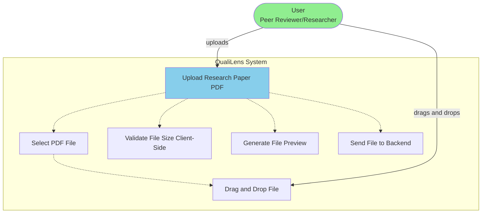
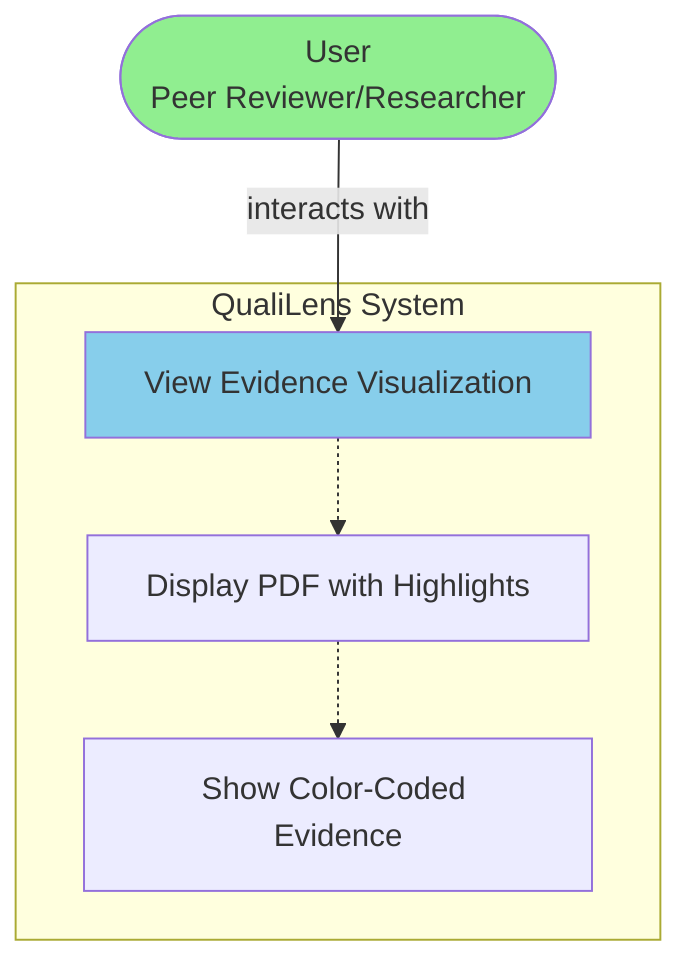
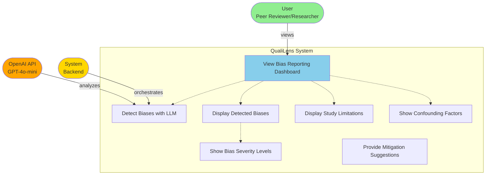
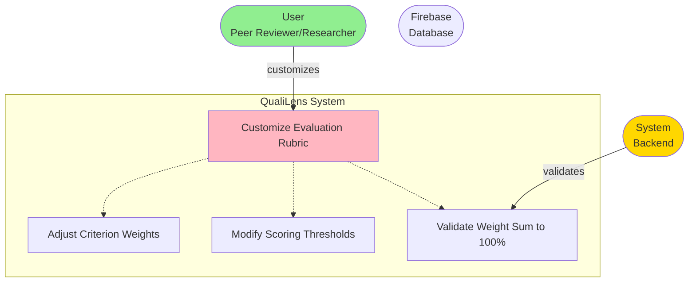
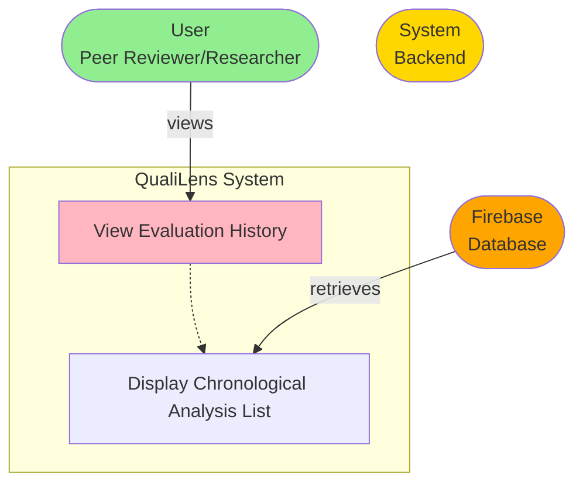
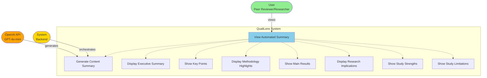
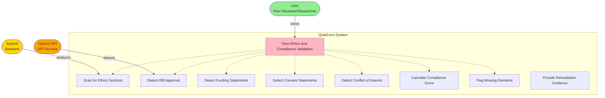

# Use Case Diagram - System-Environment Interactions

## Tabular Description of Use Cases

This section provides a comprehensive tabular description of all use cases, showing the interactions between the QualiLens system and its environment (external systems and actors).

| Use Case ID | Use Case Name | Primary Actor | External Systems/Actors | System Actions (QualiLens) | Environment Interactions | Preconditions | Postconditions | Main Flow Steps |
|------------|--------------|---------------|-------------------------|---------------------------|-------------------------|---------------|----------------|----------------|
| **U-FR1** | Upload or Link Papers | Researcher/Peer Reviewer | • Local File System • PDF.js CDN (for preview) | • Frontend: Accept drag-and-drop or file selector uploads • Validate file type (PDF only) • Validate file size (≤50MB client-side) • Generate file preview • Send file to backend via POST /api/agent/upload • Backend: Validate MIME type and size • Save to temporary file (/tmp/qualilens_uploads) • Trigger PDF parsing | • **User**: Selects PDF file or provides URL • **Local File System**: Stores temporary PDF file • **PDF.js CDN**: Renders PDF preview in browser | • User has access to PDF file or valid URL • Browser supports file upload • Backend API is accessible | • PDF file is uploaded and validated • File is stored temporarily • PDF parsing is initiated • User receives feedback on upload status | 1. User selects PDF file or provides URL 2. Frontend validates file type and size 3. Frontend sends file to backend 4. Backend validates and saves file 5. Backend triggers PDF parsing 6. System returns upload confirmation |
| **U-FR2** | Metadata Visualization | Researcher/Peer Reviewer | • OpenAI API (GPT-4o-mini) • Firebase Firestore (optional storage) | • Extract PDF metadata (title, authors, dates) using PyMuPDF • Use PaperAnalyzerTool to extract research data via LLM • Identify study design, sample size, statistical tests • Normalize metadata terms • Display structured metadata table • Show methodology section details • Show sample characteristics • Show statistical tests used | • **OpenAI API**: Analyzes paper content to extract structured metadata • **Firebase Firestore**: Optionally stores extracted metadata for caching | • PDF has been uploaded and parsed • Text content is available | • Metadata is extracted and displayed • User can view structured metadata table • Metadata can be exported (future) | 1. System extracts PDF metadata from file 2. System sends paper content to OpenAI for analysis 3. OpenAI returns structured research data 4. System displays metadata in interactive table 5. User can view methodology, sample, and statistics details |
| **U-FR3** | Interactive Quality Scoring | Researcher/Peer Reviewer | • OpenAI API (GPT-4o-mini) • SQLite Cache (local scoring cache) | • Calculate overall quality score using weighted rubric • Calculate component scores (Methodology 60%, Bias 20%, Reproducibility 10%, Statistics 10%) • Use EnhancedScorer and EvidenceBasedScorer • Collect evidence traces for each score • Display scoring dashboard with overall and category metrics • Generate scoring explanations • Show evidence references with page numbers | • **OpenAI API**: Provides analysis for scoring dimensions • **SQLite Cache**: Caches scores to avoid redundant calculations | • Paper has been analyzed • Analysis results are available | • Quality scores are calculated and displayed • User can view detailed score breakdowns • Evidence traces are linked to scores | 1. System triggers multi-tool analysis pipeline 2. System collects evidence from various analysis tools 3. System calculates weighted scores for each dimension 4. System aggregates scores into overall quality score 5. System displays interactive scoring dashboard 6. User can expand scores to view detailed reasoning |
| **U-FR4** | Evidence Visualization | Researcher/Peer Reviewer | • PDF.js CDN • Local File System (PDF coordinates) | • Map evidence traces to PDF coordinates • Generate highlight overlays for evidence • Display PDF with color-coded evidence highlights • Allow filtering by evidence type (bias, methodology, reproducibility) • Show evidence rationale on hover/click • Support screenshot/snippet export | • **PDF.js CDN**: Renders PDF with highlights in browser • **User**: Interacts with highlighted PDF | • Evidence traces have been collected • PDF coordinates are available • PDF has been parsed | • PDF is displayed with evidence highlights • User can interact with highlighted sections • Evidence details are accessible | 1. System maps evidence to PDF page coordinates 2. System generates highlight overlays 3. Frontend loads PDF using PDF.js 4. Frontend applies highlights to PDF 5. User can click highlights to view evidence details 6. User can filter evidence by type |
| **U-FR5** | Bias Reporting Dashboard | Researcher/Peer Reviewer | • OpenAI API (GPT-4o-mini) | • Use BiasDetectionTool to analyze paper • Detect linguistic indicators of bias • Identify statistical biases (p-hacking, selective reporting) • Assign confidence levels (Low/Medium/High) • Display bias analysis dashboard • Show bias severity levels • Display study limitations • Show confounding factors • Provide mitigation suggestions | • **OpenAI API**: Analyzes text for bias indicators using structured prompts | • Paper text has been extracted • Analysis has been performed | • Bias analysis is complete • Bias dashboard is displayed • User can view detected biases with confidence levels | 1. System sends paper content to BiasDetectionTool 2. Tool uses OpenAI to detect various bias types 3. System categorizes biases by type and severity 4. System displays bias dashboard 5. User can view detailed bias information |
| **U-FR6** | Reproducibility Summary | Researcher/Peer Reviewer | • OpenAI API (GPT-4o-mini) • External URLs (for validation) | • Use ReproducibilityAssessorTool • Scan paper text for reproducibility keywords • Detect data availability statements • Detect code repository links (GitHub, Zenodo) • Detect preregistration numbers • Validate URLs (if accessible) • Calculate reproducibility score • Display visual summary with checkmarks • Show reproducibility barriers | • **OpenAI API**: Analyzes text for reproducibility indicators • **External URLs**: Validated for accessibility (future) | • Paper has been parsed • Text content is available | • Reproducibility assessment is complete • Reproducibility summary is displayed • User can access detected links | 1. System scans paper for reproducibility keywords 2. System uses LLM to identify data/code availability 3. System validates detected URLs (future) 4. System calculates reproducibility score 5. System displays visual summary 6. User can view detected links and barriers |
| **U-FR7** | Rubric Customization | Researcher/Peer Reviewer | • Firebase Firestore (for storage) | • Display rubric configuration interface • Load current/default rubric weights • Allow adjustment of criterion weights • Validate weights sum to 100% • Live recalculate scores when weights change • Save rubric configuration • Support multiple rubric configurations per user | • **Firebase Firestore**: Stores rubric configurations • **User**: Adjusts weights and saves configuration | • User is authenticated (future) • Scoring system is available | • Rubric is customized and saved • Scores are recalculated with new weights • Custom rubric can be reused | 1. User opens rubric customization panel 2. System loads current/default rubric 3. User adjusts weights for each dimension 4. System validates weights sum to 100% 5. System live recalculates scores 6. User saves rubric configuration 7. System stores rubric in Firebase |
| **U-FR8** | Evaluation History | Researcher/Peer Reviewer | • Firebase Firestore | • Query Firebase for past analyses • Display chronological list of evaluations • Provide search and filtering (date, author, topic, score) • Show version metadata (model version, rubric version, timestamp) • Allow loading past evaluations • Support re-evaluation with updated models | • **Firebase Firestore**: Stores evaluation history with metadata • **User**: Views and filters history | • User has performed analyses • Firebase is configured • User is authenticated (future) | • Evaluation history is displayed • User can access past evaluations • Historical versions are preserved | 1. User requests evaluation history 2. System queries Firebase for user's analyses 3. System displays chronological list 4. User can filter/search history 5. User can load past evaluation 6. User can re-run evaluation with current models |
| **U-FR9** | Literature Benchmarking | Researcher/Peer Reviewer | • Vector Database (Pinecone - future) • OpenAI API (for embeddings) | • Generate paper embeddings using SciNCL/SPECTER2 • Search similar papers using FAISS vector search • Calculate similarity scores (cosine, Jaccard) • Aggregate benchmark statistics • Display comparative metrics • Show quality benchmarks • Display citation overlaps | • **OpenAI API**: Generates embeddings for paper • **Vector Database**: Stores and searches paper embeddings • **Reference Corpus**: Provides benchmark data | • Paper has been analyzed • Reference corpus is available • Vector database is configured | • Similar papers are identified • Comparative metrics are displayed • Quality benchmarks are shown | 1. System generates embedding for analyzed paper 2. System searches vector database for similar papers 3. System calculates similarity scores 4. System aggregates benchmark statistics 5. System displays comparative dashboard 6. User can view quality benchmarks |
| **U-FR10** | Automated Abstract and Findings Summarization | Researcher/Peer Reviewer | • OpenAI API (GPT-4o-mini) | • Use ContentSummarizerTool • Extract essential sentences from paper • Generate structured summary (Objective, Methods, Results, Conclusions) • Produce concise (≤200 words) and extended (≤600 words) versions • Identify key terms, population, intervention, outcomes • Highlight study strengths and limitations | • **OpenAI API**: Generates structured summaries using LangChain | • Paper has been parsed • Text content is available | • Summary is generated and displayed • User can view structured summary • Summary can be exported (future) | 1. System sends paper content to ContentSummarizerTool 2. Tool uses OpenAI to generate structured summary 3. System formats summary with sections 4. System displays summary in UI 5. User can view concise or extended versions |
| **U-FR11** | Ethical and Compliance Validation | Researcher/Peer Reviewer | • OpenAI API (GPT-4o-mini) • External Databases (ClinicalTrials.gov, NIH RePORTER - future) | • Scan paper for ethics sections • Detect IRB approval statements • Detect funding statements • Detect consent statements • Detect conflict of interest statements • Calculate compliance completeness score • Flag missing elements with severity levels • Provide remediation guidance | • **OpenAI API**: Analyzes text for compliance indicators • **External Databases**: Validates IRB numbers, grants (future) | • Paper has been parsed • Text content is available | • Compliance validation is complete • Compliance score is displayed • Missing elements are flagged | 1. System scans paper for ethics sections 2. System uses LLM to detect compliance elements 3. System validates against external databases (future) 4. System calculates compliance score 5. System flags missing elements 6. System displays compliance dashboard |
| **U-FR12** | Multi-Paper Comparative Dashboard | Researcher/Peer Reviewer | • Firebase Firestore • Vector Database (Pinecone - future) | • Query Firebase for all analyzed papers • Aggregate statistics across collection • Calculate descriptive statistics (mean, median, SD, IQR) • Display papers in tabular format with sortable columns • Allow filtering by domain, author, methodology • Generate visualizations (heatmaps, scatter plots) • Support export to CSV/Excel | • **Firebase Firestore**: Retrieves all analyzed papers • **Vector Database**: Enables multi-dimensional analysis (future) • **User**: Filters and compares papers | • Multiple papers have been analyzed • Papers are stored in Firebase • User is authenticated (future) | • Comparative dashboard is displayed • Aggregate statistics are shown • User can filter and compare papers | 1. User accesses multi-paper dashboard 2. System queries Firebase for all papers 3. System aggregates statistics 4. System displays papers in table 5. User can filter and sort 6. System generates visualizations 7. User can export data |

## External Systems Summary

| External System | Purpose | Interaction Type |
|----------------|---------|------------------|
| **OpenAI API (GPT-4o-mini)** | LLM-based analysis for bias detection, summarization, methodology analysis, statistical validation, reproducibility assessment | HTTPS REST API via OpenAI SDK/LangChain |
| **Firebase Firestore** | Persistent storage for analysis results, metadata, rubric configurations, evaluation history | Firebase SDK (REST API) |
| **PDF.js CDN** | Client-side PDF rendering and highlighting | HTTPS (loaded by frontend) |
| **Local File System** | Temporary file storage for uploads, local SQLite caches | Direct file I/O |
| **Vector Database (Pinecone)** | Multi-dimensional analysis and similarity search | REST API |
| **External Databases** | Validation of IRB numbers, grants, clinical trial registrations | REST API |

## System-Environment Interaction Patterns

1. **Upload Pattern**: User → Frontend → Backend → Local File System → PDF Parser
2. **Analysis Pattern**: Backend → Agent Orchestrator → Analysis Tools → OpenAI API → Results
3. **Storage Pattern**: Backend → Firebase Firestore (optional) → Retrieval
4. **Display Pattern**: Backend → Frontend → PDF.js CDN → User Browser
5. **Caching Pattern**: Backend → SQLite Cache → Score/Result Retrieval

---

## U-FR1: Upload or Link Papers

## U-FR2: Metadata Visualization

## U-FR3: Interactive Quality Scoring

## U-FR4: Evidence Visualization

## U-FR5: Bias Reporting Dashboard

## U-FR6: Reproducibility Summary

## U-FR7: Rubric Customization

**Note:** Future Feature - Not Implemented

## U-FR8: Evaluation History

**Note:** Future Feature - Not Implemented

## U-FR9: Literature Benchmarking and Similarity Analysis

**Note:** Future Feature - Not Implemented

## U-FR10: Automated Abstract and Findings Summarization

## U-FR11: Ethical and Compliance Validation

**Note:** Future Feature - Not Implemented

## U-FR12: Multi-Paper Comparative Dashboard

**Note:** Future Feature - Not Implemented
