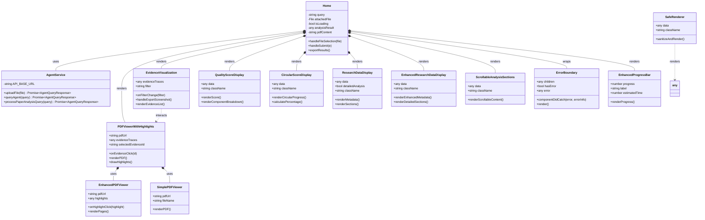

# Class and Component Diagrams

This document contains class diagrams for the backend (Python) and component diagrams for the frontend (React/TypeScript), showing the structure and relationships between system components.

## Backend Class Diagram

## Frontend Component Diagram

## System Component Diagram

## Key Relationships Summary

### Backend Relationships

1. **Inheritance:**
   - `BaseAgent` ← `ChatAgent`, `PaperAnalysisAgent`
   - `BaseTool` ← All tool implementations (ParsePDFTool, BiasDetectionTool, etc.)

2. **Composition:**
   - `AgentOrchestrator` contains `ToolRegistry`, `AgentRegistry`, `QuestionClassifier`, `OpenAIClient`
   - `BaseAgent` contains `ToolRegistry`
   - `PaperAnalysisAgent` contains `EnhancedScorer`, `EvidenceCollector`
   - `ToolRegistry` contains multiple `BaseTool` instances
   - `AgentRegistry` contains multiple `BaseAgent` instances

3. **Dependencies:**
   - Tools depend on `OpenAIClient` for LLM operations
   - `QuestionClassifier` depends on `OpenAIClient`
   - `EnhancedScorer` depends on `OpenAIClient`
   - Caching classes depend on SQLite

4. **Data Transfer Objects:**
   - `AgentResponse`, `OrchestratorResponse`, `ClassificationResult`, `ToolMetadata` are used for data transfer

### Frontend Relationships

1. **Composition:**
   - `Home` component contains and orchestrates all visualization components
   - `PDFViewerWithHighlights` uses `EnhancedPDFViewer` and `SimplePDFViewer`
   - `ErrorBoundary` wraps components for error handling

2. **Service Layer:**
   - `AgentService` provides HTTP communication with backend
   - Components use `AgentService` for data fetching

3. **Component Hierarchy:**
   - Display components (`QualityScoreDisplay`, `CircularScoreDisplay`, etc.) are leaf components
   - `Home` is the main container component

### System-Level Relationships

1. **Layered Architecture:**
   - Frontend → Backend API → Agent Orchestrator → Agent Layer → Tool Layer
   - Each layer depends on layers below it

2. **External Dependencies:**
   - LLM Layer communicates with OpenAI API
   - Backend (planned) will communicate with Firebase Firestore
   - Frontend loads PDF.js from CDN

3. **Cross-Cutting Concerns:**
   - Caching layer is used by multiple components (scoring, tools)
   - LLM layer is used by multiple components (classification, tools, scoring)

