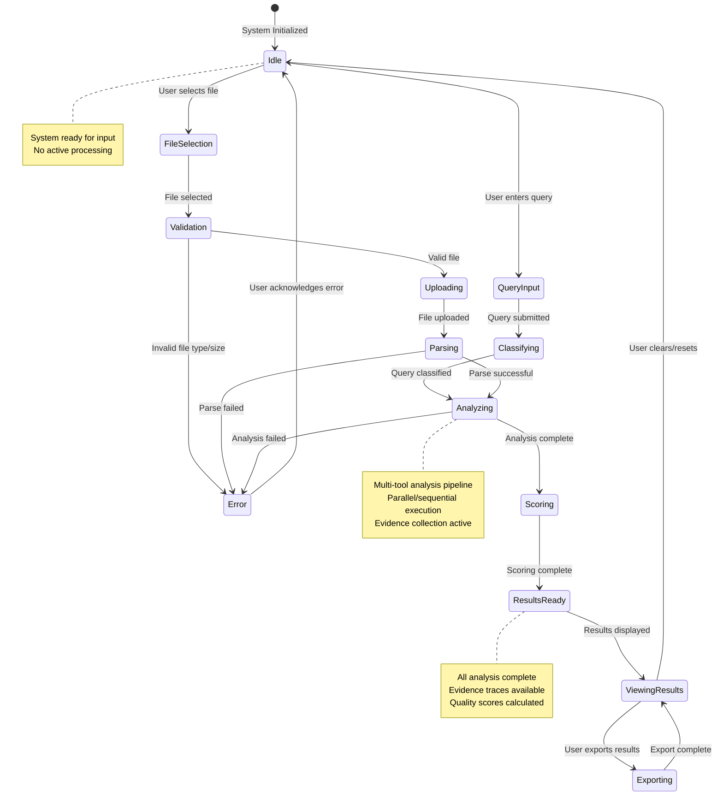
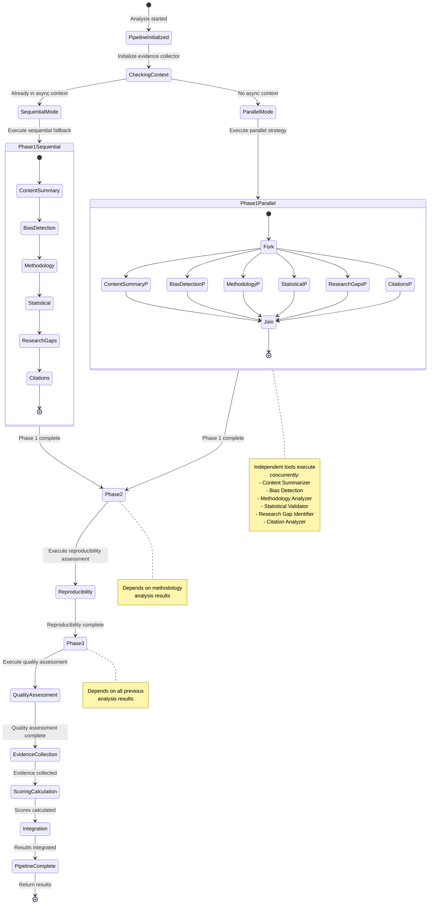
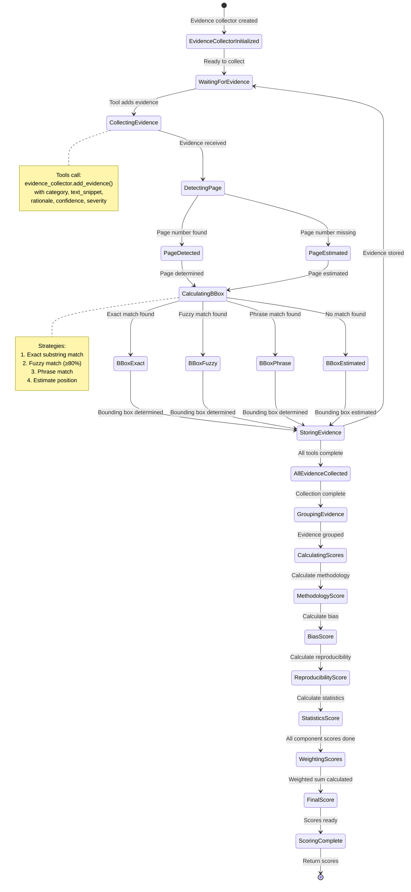

# QualiLens - State Diagrams

## Overview

This document contains state diagrams that illustrate how the QualiLens system reacts to internal and external events. State diagrams show the different states the system can be in and the transitions between them triggered by events.

---

## State Diagram 1: System-Level State Machine

This diagram shows the high-level states of the entire QualiLens system, from initial user interaction through analysis completion.

### State Descriptions (System-Level)

| State | Description | Entry Condition | Exit Condition | Activities |
|-------|-------------|-----------------|----------------|-----------|
| **Idle** | System is ready and waiting for user input | System initialization complete OR user clears previous results | User selects file OR user enters query | Display upload interface, wait for user action |
| **FileSelection** | User is selecting a file to upload | User clicks file input or drags file | File selected OR user cancels | Show file picker dialog, handle drag-and-drop |
| **QueryInput** | User is entering a text query | User focuses on query input field | Query submitted OR user cancels | Accept text input, validate query format |
| **Validation** | System is validating the uploaded file | File selected by user | Validation passes OR validation fails | Check file type (PDF), check file size (≤50MB), verify MIME type |
| **Uploading** | File is being uploaded to backend | File validation passes | Upload completes OR upload fails | Send multipart/form-data POST request, show upload progress |
| **Classifying** | System is classifying the user query | Query submitted by user | Classification complete | Question classifier determines query type, selects appropriate agent |
| **Parsing** | PDF file is being parsed | File upload completes | Parsing succeeds OR parsing fails | Extract text from PDF, extract metadata, extract coordinate data, build pages_with_coords |
| **Analyzing** | Multi-tool analysis pipeline is executing | PDF parsing succeeds OR query classification complete | All analysis tools complete OR analysis fails | Execute parallel/sequential tool pipeline, collect evidence, call OpenAI API |
| **Scoring** | Quality scores are being calculated | Analysis pipeline completes | Scoring calculation completes | Apply evidence-based scoring, calculate weighted component scores, generate final quality score |
| **ResultsReady** | Analysis results are ready for display | Scoring completes | Results are displayed to user | Package results with evidence traces, prepare JSON response |
| **ViewingResults** | User is viewing analysis results | Results are displayed | User clears OR user exports OR user uploads new file | Display PDF viewer with highlights, show quality scores, render analysis sections, enable evidence visualization |
| **Exporting** | User is exporting results to JSON | User clicks export button | Export file downloaded | Serialize results to JSON, create download blob, trigger browser download |
| **Error** | An error has occurred | Any operation fails | User acknowledges error OR user retries | Display error message, log error details, allow user to retry or clear |

### Transition Events (System-Level)

| From State | To State | Event | Condition | Action |
|------------|----------|-------|-----------|--------|
| Idle | FileSelection | `user_selects_file` | User clicks file input | Open file picker |
| Idle | QueryInput | `user_enters_query` | User focuses query field | Enable text input |
| FileSelection | Validation | `file_selected` | File chosen from picker | Validate file |
| QueryInput | Classifying | `query_submitted` | User submits query | Classify query type |
| Validation | Uploading | `validation_passed` | File is valid PDF ≤50MB | Start upload |
| Validation | Error | `validation_failed` | Invalid file type OR size >50MB | Show error message |
| Uploading | Parsing | `upload_complete` | HTTP 200 response received | Start PDF parsing |
| Classifying | Analyzing | `classification_complete` | Query type determined | Select agent and start analysis |
| Parsing | Analyzing | `parsing_successful` | PDF parsed successfully | Start analysis pipeline |
| Parsing | Error | `parsing_failed` | PDF parsing exception | Show parsing error |
| Analyzing | Scoring | `analysis_complete` | All tools executed | Calculate scores |
| Analyzing | Error | `analysis_failed` | Tool execution exception | Show analysis error |
| Scoring | ResultsReady | `scoring_complete` | Scores calculated | Package results |
| ResultsReady | ViewingResults | `results_displayed` | Frontend renders results | Show UI components |
| ViewingResults | Idle | `user_clears` | User clicks clear button | Reset all state |
| ViewingResults | Exporting | `user_exports` | User clicks export | Generate JSON file |
| Exporting | ViewingResults | `export_complete` | File downloaded | Return to viewing |
| Error | Idle | `error_acknowledged` | User dismisses error | Clear error state |

---

## State Diagram 2: Analysis Pipeline State Machine

This diagram shows the detailed states during the multi-tool analysis pipeline execution.

### State Descriptions (Analysis Pipeline)

| State | Description | Entry Condition | Exit Condition | Activities |
|-------|-------------|-----------------|----------------|-----------|
| **PipelineInitialized** | Analysis pipeline has been initialized | Analysis request received | Evidence collector initialized | Create EvidenceCollector instance, prepare text content |
| **CheckingContext** | System is checking execution context | Pipeline initialized | Context determined | Check if event loop exists, determine execution strategy |
| **SequentialMode** | Sequential execution mode selected | Already in async context detected | Phase 1 sequential complete | Execute tools one by one in order |
| **ParallelMode** | Parallel execution mode selected | No async context detected | Phase 1 parallel complete | Execute independent tools concurrently using asyncio |
| **Phase1Sequential** | Phase 1 tools executing sequentially | Sequential mode selected | All Phase 1 tools complete | Execute: ContentSummary → BiasDetection → Methodology → Statistical → ResearchGaps → Citations |
| **Phase1Parallel** | Phase 1 tools executing in parallel | Parallel mode selected | All Phase 1 tools complete | Fork execution, run 6 tools concurrently, join when all complete |
| **ContentSummary** | Content summarization tool executing | Phase 1 started | Summary generated | Call OpenAI API for summarization, collect evidence |
| **BiasDetection** | Bias detection tool executing | ContentSummary complete (seq) OR Phase 1 started (parallel) | Biases detected | Call OpenAI API for bias detection, collect evidence items |
| **Methodology** | Methodology analysis tool executing | BiasDetection complete (seq) OR Phase 1 started (parallel) | Methodology analyzed | Check cache, call OpenAI if needed, collect evidence |
| **Statistical** | Statistical validation tool executing | Methodology complete (seq) OR Phase 1 started (parallel) | Statistics validated | Call OpenAI API for statistical validation, collect evidence |
| **ResearchGaps** | Research gap identification tool executing | Statistical complete (seq) OR Phase 1 started (parallel) | Gaps identified | Call OpenAI API for gap identification, collect evidence |
| **Citations** | Citation analysis tool executing | ResearchGaps complete (seq) OR Phase 1 started (parallel) | Citations analyzed | Analyze citation patterns, collect evidence |
| **Phase2** | Phase 2: Reproducibility assessment | Phase 1 complete | Reproducibility assessed | Execute ReproducibilityAssessorTool with methodology data dependency |
| **Reproducibility** | Reproducibility assessment executing | Phase 2 started | Reproducibility score calculated | Call OpenAI API, use methodology results, collect evidence |
| **Phase3** | Phase 3: Quality assessment | Phase 2 complete | Quality assessed | Execute QualityAssessorTool with all previous results |
| **QualityAssessment** | Quality assessment executing | Phase 3 started | Quality score calculated | Aggregate all tool results, calculate quality breakdown |
| **EvidenceCollection** | Collecting evidence from all tools | Quality assessment complete | All evidence collected | Gather evidence items from EvidenceCollector, group by category |
| **ScoringCalculation** | Calculating evidence-based scores | Evidence collected | Scores calculated | Apply EvidenceBasedScorer, calculate component scores, apply weights |
| **Integration** | Integrating all analysis results | Scores calculated | Results integrated | Merge all tool results, add evidence traces, package final response |
| **PipelineComplete** | Analysis pipeline complete | Results integrated | Results returned | Return comprehensive analysis result to orchestrator |

### Transition Events (Analysis Pipeline)

| From State | To State | Event | Condition | Action |
|------------|----------|-------|-----------|--------|
| PipelineInitialized | CheckingContext | `evidence_collector_ready` | EvidenceCollector initialized | Check execution context |
| CheckingContext | SequentialMode | `async_context_detected` | Event loop already running | Use sequential fallback |
| CheckingContext | ParallelMode | `no_async_context` | No event loop running | Use parallel execution |
| SequentialMode | Phase1Sequential | `sequential_mode_selected` | Sequential mode active | Start sequential tool execution |
| ParallelMode | Phase1Parallel | `parallel_mode_selected` | Parallel mode active | Start parallel tool execution |
| Phase1Sequential | Phase2 | `phase1_sequential_complete` | All 6 tools executed sequentially | Start Phase 2 |
| Phase1Parallel | Phase2 | `phase1_parallel_complete` | All 6 tools completed in parallel | Start Phase 2 |
| Phase2 | Reproducibility | `phase2_started` | Phase 2 initiated | Execute reproducibility tool |
| Reproducibility | Phase3 | `reproducibility_complete` | Reproducibility assessment done | Start Phase 3 |
| Phase3 | QualityAssessment | `phase3_started` | Phase 3 initiated | Execute quality assessment tool |
| QualityAssessment | EvidenceCollection | `quality_assessment_complete` | Quality assessment done | Start evidence collection |
| EvidenceCollection | ScoringCalculation | `evidence_collected` | All evidence items gathered | Start scoring calculation |
| ScoringCalculation | Integration | `scoring_complete` | Scores calculated | Start result integration |
| Integration | PipelineComplete | `integration_complete` | Results integrated | Mark pipeline complete |

---

## State Diagram 3: Evidence Collection State Machine

This diagram shows the states during evidence collection and scoring.

### State Descriptions (Evidence Collection)

| State | Description | Entry Condition | Exit Condition | Activities |
|-------|-------------|-----------------|----------------|-----------|
| **EvidenceCollectorInitialized** | Evidence collector instance created | Analysis pipeline starts with PDF pages | Ready to collect evidence | Initialize EvidenceCollector with pdf_pages and pages_with_coords |
| **WaitingForEvidence** | Waiting for tools to add evidence | Evidence collector ready | Tool calls add_evidence() | Monitor for evidence additions |
| **CollectingEvidence** | Evidence item being added | Tool calls add_evidence() | Evidence metadata extracted | Receive evidence parameters: category, text_snippet, rationale, confidence, severity |
| **DetectingPage** | Detecting page number for evidence | Evidence received | Page number determined | Check if page_number provided, otherwise detect from text snippet |
| **PageDetected** | Page number found or provided | Page number available | Bounding box calculation starts | Use provided page number |
| **PageEstimated** | Page number must be estimated | Page number not provided | Page detection complete | Calculate word overlap with PDF pages, use page with ≥50% overlap, default to page 1 |
| **CalculatingBBox** | Calculating bounding box coordinates | Page number determined | Bounding box calculated | Try exact match, then fuzzy match, then phrase match, finally estimate |
| **BBoxExact** | Exact substring match found | Text snippet matches PDF text exactly | Evidence stored | Use exact block coordinates from PDF |
| **BBoxFuzzy** | Fuzzy match found (≥80% similarity) | Exact match failed, fuzzy match succeeds | Evidence stored | Use fuzzy match coordinates |
| **BBoxPhrase** | Phrase match found | Exact and fuzzy failed, phrase match succeeds | Evidence stored | Use phrase match coordinates |
| **BBoxEstimated** | Bounding box estimated | All matching strategies failed | Evidence stored | Estimate: x=0.1, y=0.2+offset, width=0.8, height=estimated |
| **StoringEvidence** | Storing evidence item | Bounding box determined | Evidence stored | Create EvidenceItem with unique ID, store in evidence_items list |
| **AllEvidenceCollected** | All tools have finished adding evidence | Analysis pipeline completes | Evidence grouping starts | All evidence items collected, ready for scoring |
| **GroupingEvidence** | Grouping evidence by category | All evidence collected | Evidence grouped | Group evidence items by category: bias, methodology, reproducibility, statistics |
| **CalculatingScores** | Starting score calculation | Evidence grouped | Component scores calculated | Initialize EvidenceBasedScorer |
| **MethodologyScore** | Calculating methodology component score | Score calculation started | Methodology score calculated | Start with base_methodology_score or 50, add/subtract score_impact from evidence |
| **BiasScore** | Calculating bias component score | Methodology score calculated | Bias score calculated | Start with 100, add score_impact (typically negative) from bias evidence |
| **ReproducibilityScore** | Calculating reproducibility component score | Bias score calculated | Reproducibility score calculated | Start with 50, add score_impact from reproducibility evidence |
| **StatisticsScore** | Calculating statistics component score | Reproducibility score calculated | Statistics score calculated | Start with 50, add/subtract score_impact from statistics evidence |
| **WeightingScores** | Applying weighted formula | All component scores calculated | Weighted sum calculated | Apply: Final = Methodology×0.6 + Bias×0.2 + Reproducibility×0.1 + Statistics×0.1 |
| **FinalScore** | Final score calculated | Weighted sum calculated | Score clamped | Clamp final score to 0-100 range |
| **ScoringComplete** | Scoring process complete | Final score ready | Scores returned | Package scores with component_scores, weighted_contributions, evidence_count |

### Transition Events (Evidence Collection)

| From State | To State | Event | Condition | Action |
|------------|----------|-------|-----------|--------|
| EvidenceCollectorInitialized | WaitingForEvidence | `collector_ready` | EvidenceCollector initialized | Wait for evidence additions |
| WaitingForEvidence | CollectingEvidence | `evidence_added` | Tool calls add_evidence() | Start evidence processing |
| CollectingEvidence | DetectingPage | `evidence_received` | Evidence parameters extracted | Start page detection |
| DetectingPage | PageDetected | `page_provided` | Page number in parameters | Use provided page |
| DetectingPage | PageEstimated | `page_missing` | No page number provided | Start page estimation |
| PageDetected | CalculatingBBox | `page_determined` | Page number available | Start bounding box calculation |
| PageEstimated | CalculatingBBox | `page_estimated` | Page detection complete | Start bounding box calculation |
| CalculatingBBox | BBoxExact | `exact_match_found` | Exact substring match | Use exact coordinates |
| CalculatingBBox | BBoxFuzzy | `fuzzy_match_found` | Fuzzy match ≥80% | Use fuzzy coordinates |
| CalculatingBBox | BBoxPhrase | `phrase_match_found` | Phrase match found | Use phrase coordinates |
| CalculatingBBox | BBoxEstimated | `no_match_found` | All matches failed | Estimate coordinates |
| BBoxExact | StoringEvidence | `bbox_determined` | Coordinates ready | Store evidence item |
| BBoxFuzzy | StoringEvidence | `bbox_determined` | Coordinates ready | Store evidence item |
| BBoxPhrase | StoringEvidence | `bbox_determined` | Coordinates ready | Store evidence item |
| BBoxEstimated | StoringEvidence | `bbox_determined` | Coordinates estimated | Store evidence item |
| StoringEvidence | WaitingForEvidence | `evidence_stored` | Evidence item stored | Wait for more evidence |
| StoringEvidence | AllEvidenceCollected | `all_tools_complete` | Analysis pipeline finished | Start evidence grouping |
| AllEvidenceCollected | GroupingEvidence | `collection_complete` | All evidence collected | Group by category |
| GroupingEvidence | CalculatingScores | `evidence_grouped` | Evidence grouped | Start score calculation |
| CalculatingScores | MethodologyScore | `scoring_started` | Scorer initialized | Calculate methodology score |
| MethodologyScore | BiasScore | `methodology_calculated` | Methodology score done | Calculate bias score |
| BiasScore | ReproducibilityScore | `bias_calculated` | Bias score done | Calculate reproducibility score |
| ReproducibilityScore | StatisticsScore | `reproducibility_calculated` | Reproducibility score done | Calculate statistics score |
| StatisticsScore | WeightingScores | `statistics_calculated` | Statistics score done | Apply weighted formula |
| WeightingScores | FinalScore | `weighted_sum_calculated` | Weighted sum done | Clamp to 0-100 |
| FinalScore | ScoringComplete | `final_score_ready` | Score clamped | Package scores |
| ScoringComplete | [*] | `scores_returned` | Scores packaged | Return to analysis pipeline |

---

