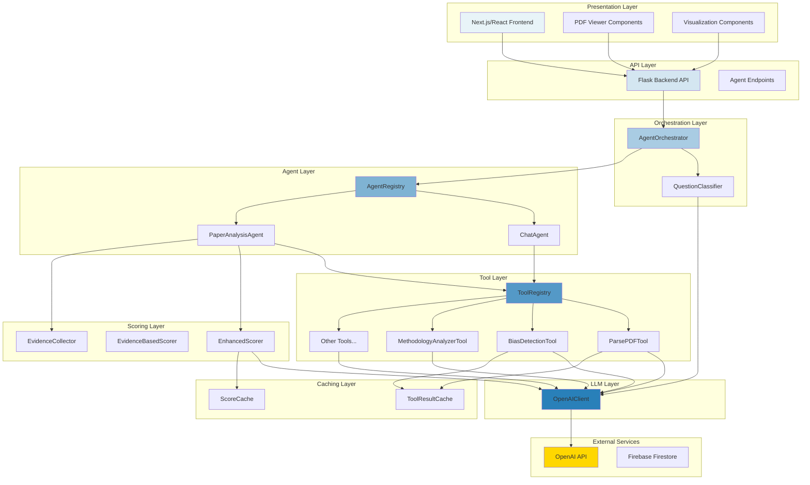
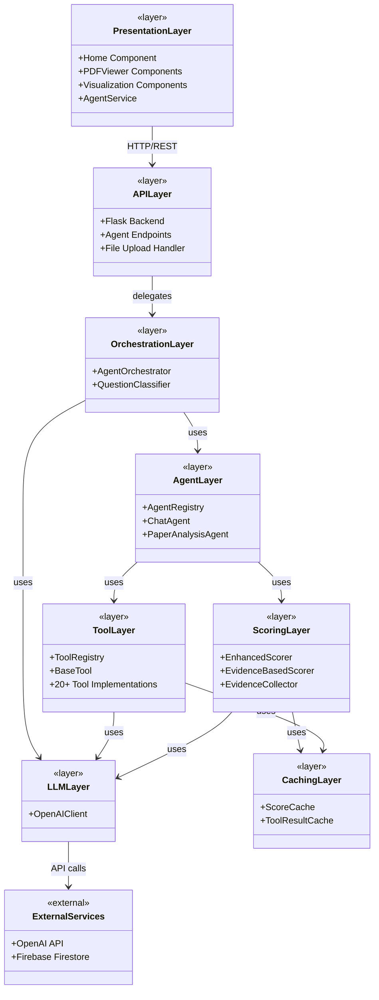
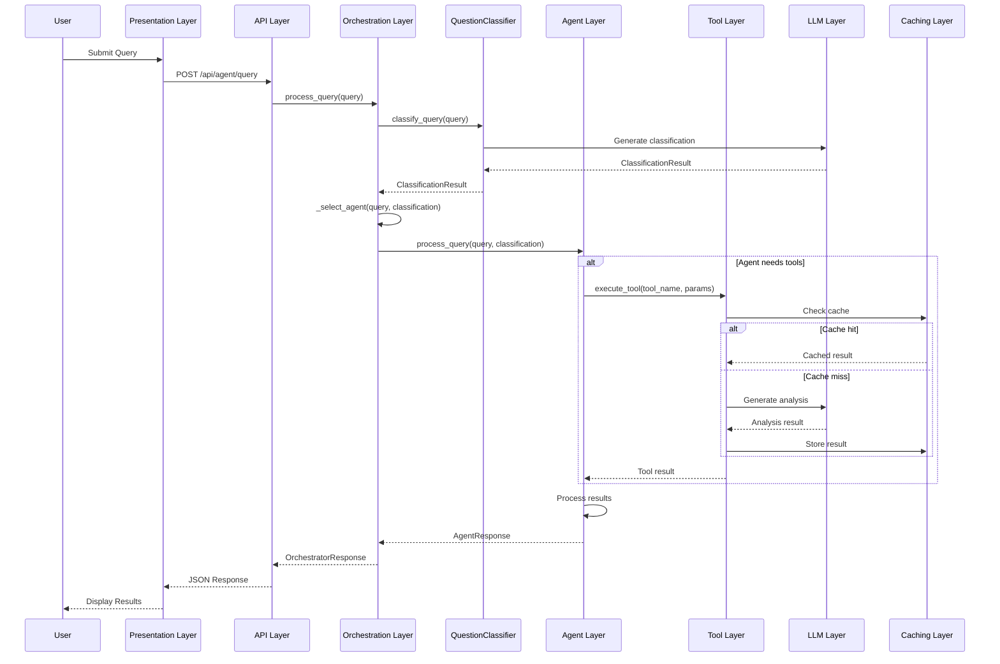
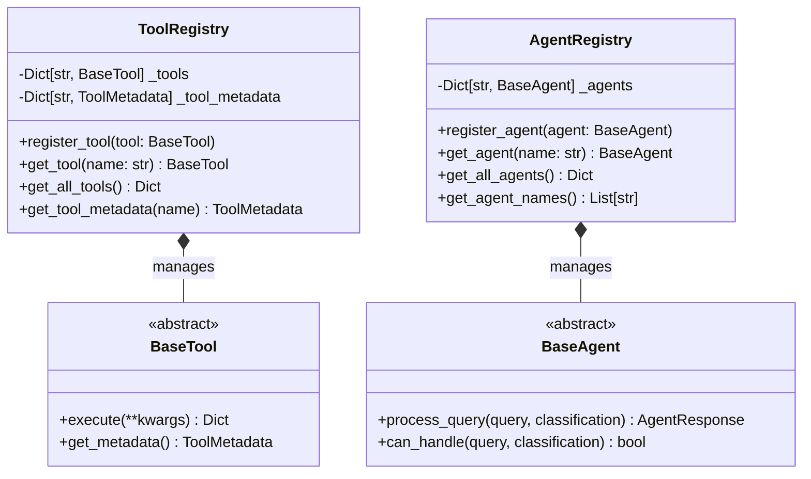
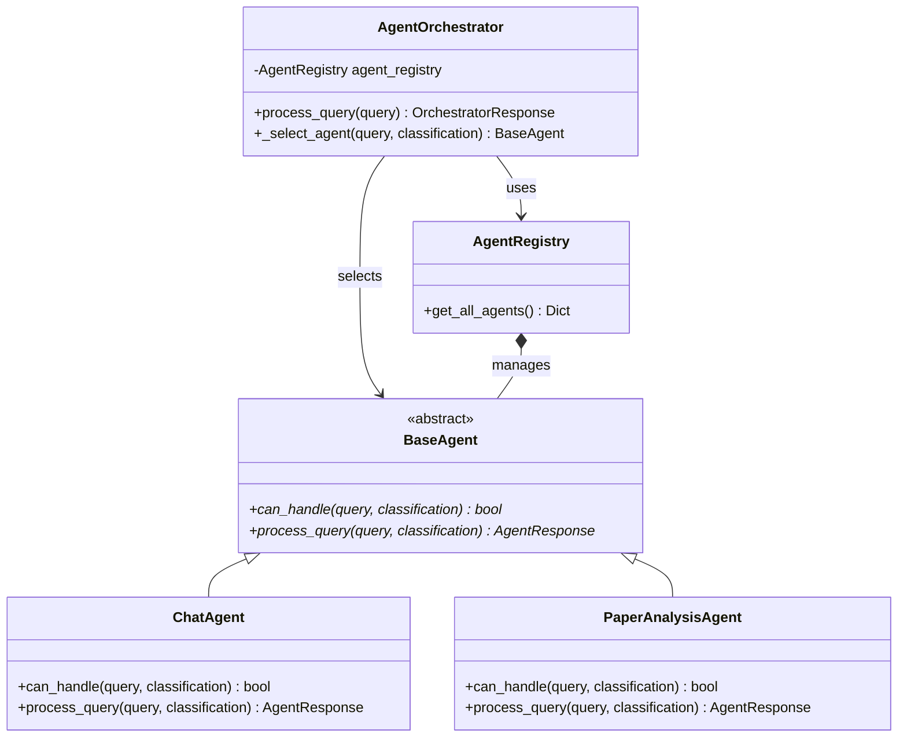

# QualiLens Architectural Pattern Documentation

## Overview

QualiLens employs a **Layered Architecture with Agent-Based Orchestration** pattern, combining multiple design patterns to create a flexible, extensible, and maintainable system for research paper quality assessment.

**Primary Pattern**: Layered Architecture  
**Secondary Patterns**: Agent-Based Architecture, Registry Pattern, Strategy Pattern, Template Method Pattern

---

## 1. Architectural Pattern Identification

### Primary Pattern: Layered Architecture

The system is organized into distinct horizontal layers, each with specific responsibilities and clear separation of concerns. Each layer can only communicate with adjacent layers, creating a clean dependency hierarchy.

### Secondary Patterns

1. **Agent-Based Architecture**: Intelligent agents orchestrate tool execution based on query classification
2. **Registry Pattern**: Centralized registries manage tools and agents dynamically
3. **Strategy Pattern**: Different agents handle different query types through a common interface
4. **Template Method Pattern**: Base classes define the structure, subclasses implement specifics

---

## 2. Tabular Description of Architecture

### 2.1 Layer Structure

| Layer | Components | Responsibilities | Technologies | Dependencies |
|-------|-----------|------------------|--------------|---------------|
| **Presentation Layer** | Home Component, PDFViewer Components, Visualization Components, AgentService | User interface rendering, user interactions, PDF display with highlights, evidence visualization, quality score display | Next.js 15.5.3, React 19, TypeScript 5, Tailwind CSS 4, PDF.js 5.4.149 | Backend API Layer |
| **API Layer** | Flask Backend API, Agent Endpoints | HTTP request handling, file upload management, request routing, response formatting | Flask 2.3.3, Python 3 | Orchestration Layer |
| **Orchestration Layer** | AgentOrchestrator, QuestionClassifier | Query classification, agent selection, request routing, execution statistics tracking | Python 3 | Agent Layer, Classification Layer, LLM Layer |
| **Agent Layer** | ChatAgent, PaperAnalysisAgent, AgentRegistry | Query processing, tool orchestration, specialized analysis workflows, agent management | Python 3 | Tool Layer, Scoring Layer, LLM Layer |
| **Tool Layer** | 20+ Specialized Tools (ParsePDFTool, BiasDetectionTool, MethodologyAnalyzerTool, etc.), ToolRegistry | Specialized analysis operations, PDF parsing, bias detection, methodology analysis, tool management | Python 3, PyMuPDF, pdfminer.six, PyPDF2 | LLM Layer, Caching Layer |
| **Scoring Layer** | EnhancedScorer, EvidenceBasedScorer, EvidenceCollector | Quality score calculation, evidence collection, weighted scoring across dimensions | Python 3 | LLM Layer, Caching Layer |
| **Classification Layer** | QuestionClassifier, ClassificationResult | Query type classification, tool suggestion, parameter extraction | Python 3 | LLM Layer |
| **LLM Layer** | OpenAIClient | Language model operations, parallel completion generation, embeddings | Python 3, LangChain, OpenAI SDK | External Services |
| **Caching Layer** | ScoreCache, ToolResultCache | Result caching, performance optimization, SQLite database management | Python 3, SQLite 3 | Local File System |
| **External Services** | OpenAI API, Firebase Firestore, PDF.js CDN | LLM services, database storage, PDF rendering library | External APIs | N/A |

### 2.2 Component Responsibilities

| Component Category | Components | Primary Responsibility | Key Methods/Operations |
|-------------------|------------|----------------------|----------------------|
| **Orchestrator** | AgentOrchestrator | Central coordination of query processing | `process_query()`, `_select_agent()`, `_update_execution_stats()` |
| **Agents** | BaseAgent, ChatAgent, PaperAnalysisAgent | Specialized query handling and tool orchestration | `process_query()`, `can_handle()`, `execute_tool()` |
| **Registries** | AgentRegistry, ToolRegistry | Dynamic component registration and discovery | `register_agent()`, `register_tool()`, `get_agent()`, `get_tool()` |
| **Tools** | BaseTool, 20+ Tool Implementations | Specialized analysis operations | `execute()`, `validate_parameters()`, `_get_metadata()` |
| **Classifiers** | QuestionClassifier | Query understanding and routing | `classify_query()`, returns `ClassificationResult` |
| **Scorers** | EnhancedScorer, EvidenceBasedScorer | Quality assessment and scoring | `calculate_final_score()`, weighted dimension scoring |
| **Collectors** | EvidenceCollector | Evidence extraction and coordinate mapping | `collect_evidence()`, `_extract_coordinates()` |
| **Caches** | ScoreCache, ToolResultCache | Performance optimization through caching | `get_cached_score()`, `cache_score()`, `get_cached_result()` |
| **LLM Client** | OpenAIClient | Language model interface | `generate_completion()`, `generate_completions_parallel()` |

### 2.3 Data Flow

| Flow Direction | Source Layer | Target Layer | Data Type | Protocol/Mechanism |
|---------------|--------------|--------------|-----------|-------------------|
| **Request Flow** | Presentation | API | HTTP Request (JSON) | HTTP/REST |
| **Request Flow** | API | Orchestration | Query String, File Data | Python Method Call |
| **Request Flow** | Orchestration | Agent | Query, ClassificationResult | Python Method Call |
| **Request Flow** | Agent | Tool | Tool Parameters (kwargs) | Python Method Call |
| **Request Flow** | Tool | LLM | Prompts, Text Content | OpenAI SDK |
| **Response Flow** | LLM | Tool | Analysis Results (JSON) | OpenAI SDK Response |
| **Response Flow** | Tool | Agent | Tool Results (Dict) | Python Return Value |
| **Response Flow** | Agent | Orchestration | AgentResponse | Python Return Value |
| **Response Flow** | Orchestration | API | OrchestratorResponse | Python Return Value |
| **Response Flow** | API | Presentation | JSON Response | HTTP/REST |

---

## 3. Graphical Descriptions

### 3.1 High-Level Layered Architecture Diagram

### 3.2 Component Diagram (UML-Style)

### 3.3 Agent-Based Orchestration Sequence Diagram

### 3.4 Registry Pattern Implementation

### 3.5 Strategy Pattern in Agent Selection

---

## 4. Justification for Architectural Pattern Choice

### 4.1 Why Layered Architecture?

**Clear Separation of Concerns**: Each layer has distinct responsibilities (UI, API, orchestration, business logic, tools), making the system easier to understand, maintain, and test. Changes in one layer don't cascade to others.

**Extensibility**: New tools and agents can be added without modifying existing code through the registry pattern. The system can grow organically with 20+ tools already registered dynamically.

**Technology Independence**: Each layer can use different technologies optimized for its needs (Next.js/React for frontend, Flask/Python for backend, OpenAI SDK for LLM operations).

**Testability**: Clear layer boundaries enable comprehensive testing at each level with mocked dependencies.

### 4.2 Why Agent-Based Orchestration?

**Intelligent Query Routing**: Different query types require different processing strategies. `ChatAgent` handles general queries while `PaperAnalysisAgent` orchestrates comprehensive paper analysis with multiple tools.

**Tool Composition**: Agents compose multiple reusable tools to solve complex problems. `PaperAnalysisAgent` uses 10+ tools in orchestrated workflows, while tools remain independent and reusable.

**Dynamic Behavior**: Agent selection and tool execution adapt based on query classification, providing intelligent routing without hardcoded logic.

### 4.3 Why Registry Pattern?

**Dynamic Component Management**: Tools and agents can be registered at runtime, enabling plugin-like architecture. No hardcoded component lists.

**Centralized Discovery**: Single source of truth for available components with metadata, making it easy to query capabilities and select appropriate tools/agents.

### 4.4 Why Template Method Pattern?

**Consistent Interface**: All tools and agents follow the same interface (`BaseTool.execute()`, `BaseAgent.process_query()`), ensuring predictable behavior and easy programmatic use.

**Code Reuse**: Common functionality implemented once in base classes (parameter validation, tool discovery), reducing duplication and ensuring consistent behavior.

### 4.5 Why Not Alternative Patterns?

**Microservices**: Not chosen because the system is not large enough to justify the complexity. Synchronous workflows benefit from simpler deployment, and network latency would hurt tool orchestration performance.

**Event-Driven**: Not chosen because request-response pattern is more appropriate for user queries. Synchronous workflows are easier to understand, debug, and don't require complex event routing.

**Monolithic**: Not chosen because it would lose separation of concerns benefits, make testing harder, constrain technology choices, and reduce extensibility.

