# QualiLens - System Context Diagram

## Overview
QualiLens is a research paper quality assessment platform that provides comprehensive analysis of academic research documents across multiple quality dimensions.

## Context Diagram (Mermaid)

```mermaid
graph TB
    subgraph External Users
        RESEARCHER[👤 Researcher<br/>Academic researcher or reviewer<br/>assessing research paper quality]
    end

    subgraph QualiLens System
        QUALILENS[🔬 QualiLens Platform<br/>Research Paper Quality Assessment<br/><br/>Frontend: Next.js 15.5.3 - port 3001<br/>Backend: Flask 2.3.3 - port 5002<br/><br/>Features:<br/>• Multi-dimensional quality scoring<br/>• Evidence-based assessment<br/>• PDF parsing and highlighting<br/>• Agent-based orchestration<br/>• 20+ specialized analysis tools]
    end

    subgraph External Systems
        OPENAI[🤖 OpenAI API<br/>GPT-4o-mini Language Model<br/><br/>Purpose: Text analysis and<br/>paper quality evaluation<br/>Temperature: 0.0 deterministic<br/>Auth: OPENAI_API_KEY]

        PDFJS[📄 PDF.js CDN<br/>Mozilla PDF.js Worker<br/><br/>Purpose: Client-side PDF<br/>rendering and text extraction]

        FILESYSTEM[💾 Local File System<br/>Temporary Storage & Caching<br/><br/>• /tmp/qualilens_uploads<br/>• score_cache.db SQLite<br/>• tool_result_cache.db SQLite]
    end

    RESEARCHER -->|1. Uploads PDF papers<br/>2. Views quality assessments<br/>3. Explores evidence with highlights<br/><br/>Protocol: HTTPS localhost:3001| QUALILENS

    QUALILENS -->|Sends paper text for:<br/>• Methodology analysis<br/>• Bias detection<br/>• Statistical validation<br/>• Reproducibility assessment<br/><br/>Protocol: HTTPS REST API| OPENAI

    QUALILENS -->|Loads PDF.js worker<br/>for browser-based rendering<br/><br/>Protocol: HTTPS CDN| PDFJS

    QUALILENS -->|Stores:<br/>• Uploaded PDFs max 50MB<br/>• Analysis result cache<br/>• Tool execution cache<br/><br/>Protocol: File I/O| FILESYSTEM

    OPENAI -.->|Returns:<br/>• Quality scores<br/>• Evidence items<br/>• Analysis results<br/><br/>Format: JSON| QUALILENS

    PDFJS -.->|Returns:<br/>• Rendered PDF pages<br/>• Text content<br/><br/>Format: JavaScript objects| QUALILENS

    FILESYSTEM -.->|Returns:<br/>• Cached scores<br/>• Tool results<br/><br/>Format: SQLite records| QUALILENS

    style QUALILENS fill:#4A90E2,stroke:#2E5C8A,stroke-width:3px,color:#fff
    style RESEARCHER fill:#7ED321,stroke:#5FA319,stroke-width:2px,color:#000
    style OPENAI fill:#FF6B6B,stroke:#CC5555,stroke-width:2px,color:#fff
    style PDFJS fill:#FFD93D,stroke:#CCB030,stroke-width:2px,color:#000
    style FILESYSTEM fill:#A084DC,stroke:#7F67B0,stroke-width:2px,color:#fff
```

## System Actors

### Primary Actor
- **Researcher/Academic Reviewer**: Uploads research papers (PDFs) and receives comprehensive quality assessments with evidence-based scoring

## External Systems

### 1. OpenAI API (GPT-4o-mini)
- **Type**: External Cloud Service
- **Purpose**: Large Language Model for paper analysis
- **Key Operations**:
  - Methodology evaluation
  - Bias detection
  - Statistical claim validation
  - Reproducibility assessment
  - Research gap identification
- **Configuration**:
  - Model: GPT-4o-mini
  - Temperature: 0.0 (deterministic scoring)
  - Authentication: OPENAI_API_KEY environment variable
- **Communication**: HTTPS REST API via OpenAI SDK

### 2. PDF.js CDN
- **Type**: External Content Delivery Network
- **Purpose**: Client-side PDF rendering library
- **Key Operations**:
  - PDF page rendering in browser
  - Text extraction for highlighting
  - PDF document parsing
- **Source**: Mozilla PDF.js (unpkg.com CDN)
- **Communication**: HTTPS (loaded by frontend)

### 3. Local File System
- **Type**: Local Storage
- **Purpose**: Temporary file storage and performance caching
- **Key Storage**:
  - **Upload Directory**: `/tmp/qualilens_uploads` (max 50MB PDFs)
  - **Score Cache**: `backend/agents/score_cache.db` (SQLite)
  - **Tool Results Cache**: `backend/tool_result_cache.db` (SQLite)
- **Characteristics**:
  - No persistent user data
  - Session-based only
  - Auto-cleanup after processing
- **Communication**: Direct file I/O operations

## System Boundaries

### What's Inside QualiLens
- Next.js frontend application (port 3001)
- Flask backend API (port 5002)
- Agent orchestration system
- 20+ specialized analysis tools
- Evidence collection engine
- Multi-component scoring system
- PDF parsing logic (PyMuPDF, PDFMiner)
- SQLite cache management

### What's Outside QualiLens
- OpenAI language model services
- PDF.js rendering library (CDN-hosted)
- Operating system file storage
- Web browser (user's device)

## Data Flow Summary

1. **Upload Flow**: Researcher → QualiLens → File System
2. **Analysis Flow**: QualiLens → OpenAI API → QualiLens → File System (cache)
3. **Display Flow**: QualiLens → PDF.js CDN → Browser → Researcher

## Quality Scoring Dimensions

The system evaluates papers across four weighted dimensions:
- **Methodology** (60%): Research design, data collection, analysis methods
- **Bias Assessment** (20%): Identification of biases and limitations
- **Reproducibility** (10%): Ability to replicate the research
- **Research Gaps** (10%): Identification of gaps and future directions

## Security & Authentication

- **No user authentication system** - Open access
- **API Security**: OpenAI API key required for LLM operations
- **CORS**: Restricted to localhost origins (3000, 3001)
- **File Upload**: PDF-only, 50MB size limit
- **Data Privacy**: No persistent user data storage

## Technology Stack

### Frontend
- Next.js 15.5.3 with React 19
- TypeScript 5
- Tailwind CSS 4
- PDF.js 5.4.149

### Backend
- Flask 2.3.3
- Python 3
- LangChain (LLM orchestration)
- PyMuPDF (PDF processing)
- SQLite 3 (caching)

## System Constraints

1. **Single API Key Dependency**: Entire system requires valid OpenAI API key
2. **No Scalability Layer**: Single-instance deployment only
3. **Local Storage Only**: No cloud storage integration
4. **Session-Based**: No persistent data or user accounts
5. **Synchronous Processing**: No background job queue
6. **Development Mode**: Running on localhost (not production-ready)

## Future External System Candidates

Systems that could be added to extend functionality:
- **Authentication Provider** (OAuth, Auth0): User management
- **Cloud Storage** (S3, Azure Blob): Persistent paper storage
- **Database Service** (PostgreSQL): User data and history
- **Analytics Service** (Google Analytics): Usage tracking
- **Email Service** (SendGrid): Notification system
- **Reference Database APIs** (PubMed, CrossRef): Citation validation

---

**Diagram Last Updated**: 2025-11-24
**QualiLens Version**: Current main branch (commit: 20eae53)
